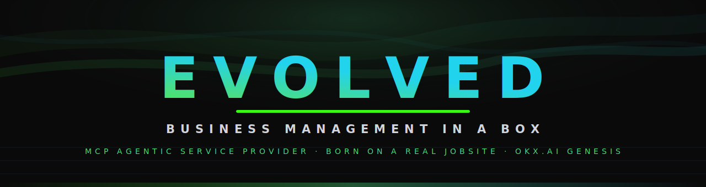
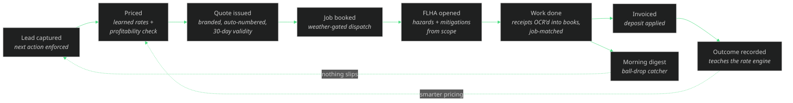
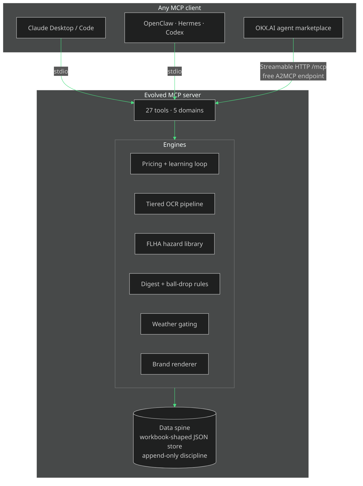

<div align="center">



<br>

**The complete operations brain of a working industrial-services company, packaged as an agentic service.**

[](https://modelcontextprotocol.io)
[](https://www.okx.ai)
[](#verify-it-yourself)
[](package.json)
[](LICENSE)

[Why](#why-this-exists) · [The loop](#the-loop) · [Tools](#the-tool-surface--27-tools) · [Quickstart](#quickstart) · [Demo](#the-90-second-demo) · [Architecture](#architecture) · [OKX.AI listing](#listing-on-okxai)

</div>

---

## Why this exists

Most "AI for business" demos are chatbots wearing a suit. **Evolved is different: it is the actual operating system of Evolve Eco Blasting, a real abrasive-blasting company in Edmonton, Alberta** — a system that already runs live on jobsites, catching receipts from truck cabs, pricing driveways, and emailing the owner a digest at 6:30 AM — re-engineered as a Model Context Protocol server any agent can drive.

Point an agent at Evolved and it can run a field-services company end to end:

- **Quote it** — a learning rate engine prices work by square footage, blast depth, surface, and access, with a live profitability check (media, labor, fuel, overhead, break-even) on every number that goes out the door.
- **Win it** — leads move through a funnel where every open lead is forced to carry a next action with a date.
- **Book it** — dispatch is weather-gated with blast-day verdicts, because you do not blast at −5 °C in a 45 km/h wind.
- **Work it safely** — the day starts with a field-level hazard assessment drafted from the job scope, with per-hazard mitigations, and ends with a crew sign-off.
- **Track every dollar** — receipts flow through tiered OCR (fast model first, automatic escalation when the math does not reconcile) into categorized, job-matched, duplicate-guarded books.
- **Get paid** — branded quotes and invoices in the company's dark aurora design, deposits applied, receivables chased.
- **Drop nothing** — a ball-drop catcher auto-raises action items: deposit in but unscheduled, invoice unpaid 7+ days, quote unanswered 7 days, quote expiring, job done but not invoiced.
- **Start every day oriented** — one morning digest: the one thing not to drop, today's jobs, money pulse, quotes out, weather verdicts.

The demo dataset is **fully synthetic** — every name, phone number, address, and dollar figure is invented — but the math, the rules, and the workflow are the real ones a real company runs on.

## The loop



Two feedback loops make it more than a CRUD wrapper: **pricing outcomes teach the quote engine** (residential driveways have already converged to ~$9/sqft from won-job history), and **the digest re-scans the books daily** so anything stalled gets raised as an action item instead of dying quietly.

## The tool surface — 27 tools

| Domain | Tools | What they do |
|---|---|---|
| **Quoting intelligence** | `quote_price` · `quote_create` · `quote_render` · `quote_update_status` · `quote_list` · `pricing_rates` · `pricing_record_outcome` | Learned $/sqft rates by depth and surface, access factors, mobilization, 5% GST, 25% deposit, break-even guard, branded HTML documents, and the learning loop |
| **Money** | `receipt_ingest` · `expense_report` · `invoice_create` · `invoice_render` · `pnl_report` | Tiered-OCR receipt pipeline with duplicate guard and job matching, categorized expense ledger with reclaimable GST, invoicing with deposits applied, per-job and monthly P&L with a business scorecard |
| **Pipeline** | `lead_capture` · `lead_update` · `pipeline_view` · `job_schedule` · `job_complete` · `customer_list` | Sales funnel with enforced next actions, dispatch board with weather verdicts, job close-out with actuals and margin verdicts |
| **Safety** | `flha_open` · `flha_signoff` · `safety_log` | Field-level hazard assessments drafted from job scope with per-hazard mitigations, standard PPE, end-of-day crew sign-off, permanent safety record |
| **Autonomous ops** | `morning_digest` · `action_items_scan` · `action_item_resolve` · `weather_check` · `business_snapshot` · `demo_reset` | The 6:30 AM briefing, the five ball-drop rules, blast-day weather gating, and the one-screen business health check |

Full parameter-level reference: [docs/TOOLS.md](docs/TOOLS.md).

## Quickstart

```bash
git clone https://github.com/kr8tiv-ai/evolved.git
cd evolved
npm install
npm run build
npm test        # 12 tests: pricing math, OCR regressions, full-loop E2E
npm run demo    # the whole business loop in your terminal
```

**Claude Desktop / Claude Code / any MCP client (stdio):**

```json
{
  "mcpServers": {
    "evolved": {
      "command": "node",
      "args": ["<path-to>/evolved/dist/index.js"]
    }
  }
}
```

**HTTP mode (the A2MCP endpoint):**

```bash
npm run start:http
# → MCP Streamable HTTP on http://localhost:8788/mcp
# → GET /health for service metadata
```

No API keys, no accounts, no network needed — the whole system runs offline on the synthetic dataset. Optional live upgrades: set `ANTHROPIC_API_KEY` for real Haiku→Sonnet receipt OCR, and `EVOLVED_LIVE_WEATHER=1` for real Open-Meteo forecasts.

## The 90-second demo

`npm run demo` drives a real MCP client against the real server and tells the whole story:

1. A dental clinic wants its entrance concrete refreshed — **lead captured**, next action enforced.
2. `quote_price` returns the learned rate, access-adjusted subtotal, GST, deposit, and a **62% margin verdict** in one call.
3. `quote_create` books it into the ledger as `ECO-Q-MMDDYY-NN`, valid 30 days.
4. `quote_render` emits the **branded dark quote document** — Cyber Lime underline, diamond bullets, big green total.
5. The client accepts — **a job opens automatically** and the lead flips to Won.
6. `job_schedule` books tomorrow and returns a **blast-day weather verdict** with the booking.
7. `flha_open` drafts the day's **hazard assessment from the job scope** — pressurized lines, dust, pedestrians — each with concrete mitigations.
8. A fuel receipt from the road goes through **tiered OCR into the books**, matched to the job.
9. `job_complete` records actuals, the FLHA is signed off, the **invoice goes out with the deposit applied**, and the outcome **teaches the rate engine**.
10. Next morning's digest surfaces all of it — and anything that stalled.

Walkthrough script with expected output: [docs/DEMO.md](docs/DEMO.md).

## Architecture



Design notes, the data model, and the production lineage (what maps to the live Google Sheets workbook and Apps Script system): [docs/ARCHITECTURE.md](docs/ARCHITECTURE.md).

### Battle scars, inherited

This codebase carries fixes for real production incidents, regression-tested:

- **The comma bug.** The original receipt parser read `$1,250.00` as `1.25` and silently undercounted expenses — hitting the biggest media and fuel receipts hardest. `parseAmount()` here survives thousands separators in both North American and European styles, and the test suite makes sure it stays dead.
- **Reconciliation before posting.** Subtotal + GST ≠ total does not just get logged — it drops extraction confidence and triggers escalation to a stronger model, then flags the receipt for review in the digest.
- **Flag, never silently raise.** The owner sometimes prices below market for relationships. Below-break-even work is honoured but flagged — the engine advises, the human decides.

## Verify it yourself

```bash
npm test
# ✔ pricing: subtotal = sqft × rate × access + mobilization; GST 5%; deposit 25% of total
# ✔ pricing: learning loop pulls driveway medium toward ~$9/sqft, never below base
# ✔ ocr: comma thousands-separator regression (the production P0 bug)
# ✔ full loop: lead → quote → accept → schedule → flha → receipt → complete → invoice → digest
# ✔ action items: seed data raises the five ball-drop rules
# ... 12 passing
```

## Listing on OKX.AI

Evolved lists as an **A2MCP Agentic Service Provider**: a standardized MCP service with a free endpoint that returns results directly — no payment challenge required. A paid tier can wrap the same endpoint with an x402 handler (OKX Payment SDK) without touching the tool layer. Listing steps, registration prompts, and the service manifest: [docs/OKX-LISTING.md](docs/OKX-LISTING.md).

## Honest edges

- The data spine is a local JSON store shaped like the production workbook; swapping in the live Google Sheets router API is a storage-adapter change, not a redesign.
- Offline OCR handles text receipts; image receipts need the live API path.
- Weather verdicts are synthetic offline (deterministic, so demos repeat) and real with `EVOLVED_LIVE_WEATHER=1`.

## Provenance

Built by [Matt Haynes](https://github.com/Matt-Aurora-Ventures) (KR8TIV AI) from the live operations system of Evolve Eco Blasting for the OKX.AI Genesis Hackathon, July 2026. The production system — field capture app, autopilot filing engine, morning digest, and router API — runs the real company daily; Evolved is that brain, made portable.

MIT licensed. Synthetic data only — no real financials, customers, or credentials anywhere in this repository.
