<div align="center">


### Most AI talks about business. Evolved runs one.

One agent takes a service business from a texted photo to a paid, on-chain invoice — proven on a real Alberta blasting company, adaptable to any trade in one call. **83 tools, live as an MCP service, settling in OKB on OKX X Layer testnet.**

**▶ [TRY IT LIVE — the browser playground](https://www.evolvedmcp.cloud/)** — no install, no keys: run voice commands, photo-quote a driveway, drive the autonomous lifecycle through its two human money gates, and watch the x402 402 → proof → receipt flow, all against the real endpoint.

**🎬 [Watch the 90-second demo](submission/evolved-demo.mp4)** — branded, captioned, two-act cut ([notes + license](submission/DEMO-VIDEO.md)).

[](https://modelcontextprotocol.io)
[](https://www.okx.ai)
[](https://web3.okx.com/xlayer)
[](https://www.evolvedmcp.cloud/health)
[](docs/TOOLS.md)
[](#every-claim-is-tested)
[](LICENSE)

[Judge tour](#the-60-second-judge-tour) · [Why this wins](#why-this-wins) · [The lifecycle](#watch-one-agent-run-the-whole-engagement) · [On-chain](#paid-on-chain-okx-x-layer) · [Frontier](#the-frontier-set) · [83 tools](#the-tool-surface--83-tools-16-domains) · [Docs](docs/)

</div>

---

## The 60-second judge tour

The service is live. You can verify every headline claim from your terminal before reading another word.

```bash
# 1 · It exists, and it is an MCP service (10 seconds)
curl https://www.evolvedmcp.cloud/health

# 2 · It monetizes as an ASP — x402 pay-per-call (the 402 challenge, scheme "exact", eip155:1952)
curl -i -X POST https://www.evolvedmcp.cloud/mcp-paid \
  -H 'Content-Type: application/json' -H 'Accept: application/json, text/event-stream' \
  -d '{"jsonrpc":"2.0","id":1,"method":"initialize","params":{"protocolVersion":"2025-03-26","capabilities":{},"clientInfo":{"name":"judge","version":"1"}}}'

# 3 · Pay the challenge, get the service (settlement receipt in the X-PAYMENT-RESPONSE header)
#     (header is base64 of {"simulated":true} — quote-safe on every shell, incl. PowerShell)
curl -i -X POST https://www.evolvedmcp.cloud/mcp-paid \
  -H 'Content-Type: application/json' -H 'Accept: application/json, text/event-stream' \
  -H 'X-PAYMENT: eyJzaW11bGF0ZWQiOnRydWV9' \
  -d '{"jsonrpc":"2.0","id":1,"method":"initialize","params":{"protocolVersion":"2025-03-26","capabilities":{},"clientInfo":{"name":"judge","version":"1"}}}'

# 4 · The revenue scoreboard (paid calls + settlements, survives demo resets)
curl https://www.evolvedmcp.cloud/stats
```

Then run the whole company locally — no keys, no accounts, no funds:

```bash
git clone https://github.com/kr8tiv-ai/evolved.git && cd evolved
npm install && npm run build
npm test        # 41 tests — including a LIVE X Layer testnet probe
npm run demo    # the business loop, narrated in your terminal
```

## Why this wins

**Every "AI for business" demo is a chatbot wearing a suit. Evolved is a complete company operating system any service business can spin up in one call — and it is built from the operating system of a real one.** `franchise_spinup { tradePack: "pressure-washing" }` hands the whole machine to another trade in seconds; the credibility comes from Evolve Eco Blasting, the working Alberta abrasive-blasting company whose rates, GST and deposit policy, safety practice, and ball-drop rules run the demo — reimplemented, extended, and tested here. The demo dataset is synthetic; the math is not, and neither is the trade.

- **Real-world ASP, both OKX rails.** Customer invoices settle in OKB on X Layer via EIP-681 requests verified by read-only RPC, and Evolved itself is monetized per-call through x402. An SMB earning on-chain *and* an agent service billing on-chain, in one submission.
- **Autonomy with judgment.** One agent runs lead → e-sign → weather-gated booking → FLHA safety → books → invoice → on-chain settlement → review — and holds at exactly two human gates, both about money. Agentic where it should be, accountable where it must be.
- **It learns — and never stops.** Won jobs teach the rate engine (driveways converged to ~$9/sqft from outcome history), and every logged outcome now lifts a live **confidence** score and tightens the suggested quote range — more data, sharper quotes, on real or synthetic history alike. Each learned rate is **benchmarked against the market band** it derives from the trade's own card (`market_benchmark`, `pricing_learning_status`), so a quote is never blind; the books re-audit themselves daily; insight rankings train on the owner's feedback.
- **It is hardened, not vibed.** A documented adversarial review pass produced 29 confirmed findings — including on-chain replay protection and e-sign decline finality — every one fixed and regression-tested in [`f6acd80`](https://github.com/kr8tiv-ai/evolved/commit/f6acd80). 41 tests pass, one of them live against X Layer testnet.
- **Your books live in a real workbook.** The whole OS renders as an operations workbook — every collection a tab. `workbook_create` builds and syncs an actual **Google Sheets** workbook (service-account JWT, no SDK, no keys stored); `workbook_export` writes the identical 20 tabs as CSV with zero credentials. The spine the production company runs on, available to every adapted business.
- **It scales past one company.** `franchise_spinup` re-seeds the entire OS for any trade with a custom rate card in one call — `franchise_preview` window-shops it safely, `brand_configure` makes the rendered quotes feel like *your* company. Business management in a box is the product, not the tagline.

## Watch one agent run the whole engagement

```mermaid
%%{init: {"theme": "dark", "themeVariables": {"primaryColor": "#101010", "primaryBorderColor": "#4ade80", "primaryTextColor": "#f3f4f6", "lineColor": "#4ade80", "fontFamily": "Segoe UI"}}}%%
flowchart LR
    A[Lead<br><i>typed, voice,<br>or photo</i>] --> B[Priced quote<br><i>learning rates +<br>profitability check</i>]
    B --> G1{{"🔒 HUMAN GATE<br>approve the quote"}}
    G1 --> C[E-sign<br><i>HMAC token · declines<br>are final</i>]
    C --> D[Booked on the first<br>Good blast day<br><i>weather-gated</i>]
    D --> E[FLHA drafted<br><i>hazards + mitigations<br>from scope</i>]
    E --> F[Work done<br><i>actuals, inventory<br>burn-down, receipts</i>]
    F --> H[Invoice<br><i>deposit applied</i>]
    H --> I[On-chain payment<br><i>EIP-681 on X Layer<br>testnet · replay-protected</i>]
    I --> G2{{"🔒 HUMAN GATE<br>confirm settlement"}}
    G2 --> J[Review request +<br>rate engine taught]
    J -.->|smarter pricing| B
```

<div align="center">

</div>



Every step lands in an audit log. Try it through any MCP client: `lifecycle_start`, then `lifecycle_advance { approveQuote: true, esignSigner: "..." }`, then `lifecycle_advance { simulatePayment: true }` — or hand it a real X Layer testnet `txHash` and watch the read-only RPC verification confirm it.

## Paid on-chain (OKX X Layer)

### Why on-chain matters *here* — not as a bolt-on

A blasting crew buys media and fuel **before the first grain hits the driveway**. A trades business lives or dies on cash flow and finality, and that is exactly what on-chain settlement fixes:

- **Instant.** The deposit clears in seconds — not a 3-day e-transfer hold or a 30-day net invoice. The abrasive and fuel get funded *today*, so the agent can book the crew now.
- **Final.** No chargebacks. A card can reverse weeks later, after the media is already blasted onto someone's concrete and the cost is sunk. On-chain, paid is paid.
- **Programmable.** The 25% deposit is enforced in code and encoded into the EIP-681 request (`invoice_payment_request { split: "deposit" }`) — not a number a human has to remember to collect.
- **Self-verifying.** The agent confirms the money landed itself via read-only RPC before it commits the crew — no waiting on a person to check the bank.

For a cash-tight trade, that is not a feature. It is the difference between taking the job and turning it down.

**TESTNET ONLY — and Evolved never holds keys, never signs, never broadcasts.** It issues payment requests and verifies settlement with read-only RPC; funds can only move from the payer's own wallet, and replay protection guarantees one transaction settles exactly one thing.

| Rail | What happens |
|---|---|
| **SMB invoices settle on-chain** | `invoice_payment_request` converts a balance due into an EIP-681 URI in test OKB on chainId **1952** (Terigon). `invoice_payment_check` verifies the transaction on-chain — exists, succeeded, right recipient, sufficient value, never used before — then flips the invoice and job to Paid. `xlayer_status` proves the rail is live RPC, not a mock. |
| **Evolved bills per-call via x402** | `POST /mcp-paid` answers `402 Payment Required` with a spec-shaped `accepts` envelope (scheme `exact`, network `eip155:1952`, base64 copy in the `PAYMENT-REQUIRED` header) until proof arrives in the `X-PAYMENT` header; settled calls carry an `X-PAYMENT-RESPONSE` receipt. The free A2MCP tier at `POST /mcp` stays free. |

Simulated mode is the default so judges can run everything offline, and every simulated settlement says so; `EVOLVED_X402_MODE=live` fails closed and demands real testnet transactions. Full protocol detail: [docs/ONCHAIN.md](docs/ONCHAIN.md).

## The frontier set

| | |
|---|---|
| **📸 Photo-to-quote** | A customer texts a photo; `quote_from_photo` estimates surface, area, condition, and blast depth (Claude vision with a key, or a deterministic offline estimator that parses real JPEG/PNG headers), then hands back what a seasoned estimator would — a **confidence-banded price range** (not a blind number), the **comparable jobs already in the books** it's grounded in, a market benchmark, and the exact site factors that could move it — before booking a branded draft with a measure-to-confirm clause. Absurd dimensions are clamped, not passed through. Seconds, not site visits. |
| **🎙️ Voice field commands** | "Used four bags of crushed glass on the Kowalczyk job" burns down inventory against that job's P&L. "Open the FLHA" drafts the day's hazard assessment. "Next stop?" reads the dispatch board. Unmatched job hints refuse rather than guess, and unrecognized speech is captured to the inbox — nothing is lost, nothing is misfiled. |
| **📈 Agentic CFO** | `cfo_forecast` answers add-a-truck (capex, utilization ramp, break-even month), rate changes (with price elasticity), and demand shocks with a 12-month cash table grounded in the books, weather-gated seasonality, and every assumption stated. `cfo_health` is the one-pager an owner actually needs. |
| **📦 Franchise spin-up** | `franchise_spinup` re-seeds the entire OS for a new company in a different trade — name, rate card, region — empty books, full machinery: quoting, receipts, FLHA, digest, learning loop, on-chain invoicing. One company's operating system becomes anyone's. |

## Make it yours — an adaptable toolkit, not a one-off

The company is swappable. `franchise_spinup { tradePack: "pressure-washing", confirm: true }` re-seeds the entire OS for another trade — its own rate card in the quoting engine, **its own hazards in every FLHA the system drafts**, empty books, full machinery. Three packs ship today (`pressure-washing`, `line-painting`, `mobile-detailing`); adding yours is one entry in [`src/trades.ts`](src/trades.ts). And the server speaks the whole MCP spec, not just tools: **resources** (`evolved://rate-table`, `evolved://hazard-library`, `evolved://trade-packs`) and **prompts** (`morning-briefing`, `quote-a-job`, `run-the-lifecycle`) come built in, so any MCP client gets one-line entry points. The 10-minute adaptation guide: [docs/ADAPT.md](docs/ADAPT.md). Security posture and threat model: [SECURITY.md](SECURITY.md).

## Full parity with the production system

Everything the live field app and ops workbook do, as first-class tools: **inventory control** (par levels, reorder suggestions priced from real COD receipts, per-job burn-down, supplier price-spike watch), **contacts/CRM** (customers with balances, suppliers with pricebooks, crew with certifications), **the ops-sheet engine** (the data spine rendered as the operations workbook — the field App Inbox with a deterministic filing engine), **accounting depth** (tiered-OCR receipts with vendor canonicalization and duplicate guards, discrepancy reports, escalating receivables reminders, P&L with reclaimable GST), **the workbook spine** (a real Google Sheets workbook created and synced from the database, or the same 20 tabs as CSV with zero credentials), **field operations** (before/after photo albums with gap detection, voice and text field notes that never get lost, a crew time clock that feeds real labor cost into Job P&L, and hazard assessments authored ON-SITE by the crew — auto-drafts are only starting points), and **growth** (review requests with a tracked response rate, the reputation ledger and testimonial bank, the Job P&L scorecard with win rate and overall margin, and the live dispatch board).

## The tool surface — 83 tools, 16 domains

| Domain | Tools |
|---|---|
| **Quoting intelligence** | `quote_price` · `quote_create` · `quote_render` · `quote_update_status` · `quote_list` · `pricing_rates` · `pricing_record_outcome` · `market_benchmark` · `pricing_learning_status` |
| **Money** | `receipt_ingest` · `expense_report` · `invoice_create` · `invoice_render` · `pnl_report` |
| **Pipeline** | `lead_capture` · `lead_update` · `pipeline_view` · `job_schedule` · `job_complete` · `customer_list` |
| **Safety (FLHA)** | `flha_open` · `flha_signoff` · `safety_log` |
| **Autonomous ops** | `morning_digest` · `action_items_scan` · `action_item_resolve` · `weather_check` · `business_snapshot` · `demo_reset` |
| **Inventory control** | `inventory_status` · `inventory_receive` · `inventory_consume` · `inventory_reorder_suggestions` · `price_watch` |
| **Contacts / CRM** | `contact_search` · `supplier_add` · `supplier_pricebook` · `crew_add` · `crew_roster` |
| **Ops-sheet engine** | `sheet_tabs` · `sheet_read` · `sheet_append_todo` · `inbox_submit` · `inbox_list` · `inbox_file` |
| **Accounting depth** | `vendor_rollup` · `receipt_report` · `invoice_remind` |
| **On-chain (X Layer testnet)** | `invoice_payment_request` · `invoice_payment_check` · `xlayer_status` · `x402_info` |
| **Autonomous lifecycle** | `lifecycle_start` · `lifecycle_advance` · `lifecycle_status` · `quote_esign_sign` · `review_record` |
| **Frontier** | `quote_from_photo` · `voice_command` · `cfo_forecast` · `cfo_health` |
| **Business-in-a-box** | `insights_generate` · `insight_feedback` · `activity_feed` · `backup_create` · `backup_list` · `franchise_spinup` |
| **Workbook spine** | `workbook_create` · `workbook_sync` · `workbook_link` · `workbook_export` · `workbook_status` |
| **Field ops** | `field_photo_log` · `field_note` · `crew_checkin` · `crew_checkout` · `flha_field_capture` |
| **Growth** | `review_request` · `reputation_report` · `job_pnl_report` · `dispatch_board` · `brand_configure` · `franchise_preview` |

Parameter-level reference, generated from the live server so it cannot drift: [docs/TOOLS.md](docs/TOOLS.md).

## The scaffolding

Three layers, dependencies pointing one way: tools validate and delegate, engines compute, the store persists. Swap the trade pack and every layer follows.

```text
src/
├── index.ts            stdio entry — plug into Claude Desktop / any MCP client
├── http.ts · app.ts    Streamable HTTP: /mcp (free) · /mcp-paid (x402) · /health · /stats
├── server.ts           assembles all 83 tools + 3 MCP resources + 3 prompts
├── playground.ts       the zero-install browser playground (Judge Mode lives here)
├── tools/              16 domains — thin, zod-validated handlers (quoting, money, pipeline,
│                       safety, inventory, contacts, sheet, accounting, payments, lifecycle,
│                       vision, voice, cfo, ops, opsplus, workbook, field, growth)
├── engine/             pure business logic — pricing + learning loop, OCR, safety/FLHA,
│                       weather gating, digest, actions (ball-drop rules), CFO, NLU (voice),
│                       vision, x402/X Layer payments, brand rendering, and the Google
│                       Sheets workbook spine (service-account JWT via node:crypto, no SDK)
├── trades.ts           trade packs — the one file you touch to adapt Evolved to your trade
├── seed.ts · store.ts  synthetic workbook-shaped data spine (JSON, git-ignored at runtime)
└── test/               41 tests — engines, E2E lifecycle, x402 over HTTP, live testnet probe
```

## Wire it into your agent

```json
{ "mcpServers": { "evolved": { "command": "node", "args": ["<path-to>/evolved/dist/index.js"] } } }
```

Works with Claude Desktop, Claude Code, OpenClaw, Hermes, Codex — anything that speaks MCP. HTTP mode (`npm run start:http`) serves the free tier at `POST /mcp`, the x402 tier at `POST /mcp-paid`, and `GET /health`. Optional live upgrades: `ANTHROPIC_API_KEY` (real vision and OCR escalation), `EVOLVED_LIVE_WEATHER=1` (real forecasts), `EVOLVED_X402_MODE=live` (require real testnet transactions), `EVOLVED_PAYTO=0x…` (your testnet receiving address).

Then ask it things a business owner would:

> "Run the morning digest. What am I about to drop?"
> "A property manager wants a 2,100 sqft parkade level profiled, tight access — price it, and if the margin is healthy, create the quote and render the document."
> "Should I buy a second truck this fall?"

## Every claim is tested

```bash
npm test
# ✔ pricing: learning loop pulls driveway medium toward ~$9/sqft, never below base
# ✔ ocr: comma thousands-separator regression (the production P0 bug)
# ✔ autonomous lifecycle: lead → e-sign → weather booking → FLHA → invoice → on-chain settle → review → learning
# ✔ x402 over real HTTP: 402 challenge, then simulated proof unlocks the MCP surface
# ✔ X Layer testnet RPC: live read-only probe (chainId 1952 asserted)
# ✔ review fixes: replay protection, declined e-sign is final, custom price break-even flag
# ✔ franchise spin-up re-seeds the OS for a new trade
# ✔ pricing: confidence rises with data, quote range tightens, market benchmark flags under/over
# ✔ workbook: 20 tabs cover the whole OS; CSV export writes real files; no-creds create falls back
# ✔ field ops: photo album gaps, note routing to the inbox, time clock feeds Job P&L labor
# ✔ safety: the JHA is authored on-site — field capture creates or upgrades the day's FLHA
# ✔ growth: review loop, reputation ledger, dispatch board flags, brand config, pack preview
# … 41 passing
```

The battle scars are real and documented: the production receipt parser once read a $1,250 media invoice as $1.25 — that comma bug is fixed here and pinned by regression tests, along with 28 other adversarial-review findings shipped in [`f6acd80`](https://github.com/kr8tiv-ai/evolved/commit/f6acd80) (replay protection, decline finality, break-even flagging, and the long tail). Architecture, data model, and production lineage: [docs/ARCHITECTURE.md](docs/ARCHITECTURE.md).

## The submission

Built for the **OKX AI Genesis Hackathon** by [Matt Haynes](https://github.com/Matt-Aurora-Ventures) (KR8TIV AI) from the live operations system of [Evolve Eco Blasting](https://www.evolveecoblasting.com), July 2026.

| | |
|---|---|
| **Try it live** | [www.evolvedmcp.cloud](https://www.evolvedmcp.cloud/) — browser playground, zero install |
| Live endpoint | `/mcp` (free A2MCP) · `/mcp-paid` (x402) · `/health` · `/stats` (revenue scoreboard) |
| Listing | A2MCP ASP with an implemented x402 paid tier — [docs/OKX-LISTING.md](docs/OKX-LISTING.md) |
| Demo script | Two-act 90-second cut — [docs/DEMO.md](docs/DEMO.md) |
| **Demo video** | [submission/evolved-demo.mp4](submission/evolved-demo.mp4) — 90s, 1080p, on-brand, captioned, royalty-free funk soundtrack ([notes](submission/DEMO-VIDEO.md)) — streams from the live deployment at [/demo.mp4](https://www.evolvedmcp.cloud/demo.mp4) |
| Categories | Best Product · Revenue Rocket · Software Utility · Finance Copilot |

MIT licensed. Synthetic data only; testnet only; no secrets anywhere in this repository. Evolved never holds keys and cannot move funds — by construction.

<div align="center">
<br>
<code>OKX AI GENESIS · MCP AGENTIC SERVICE PROVIDER · X LAYER TESTNET 1952 · BUILT ON A REAL JOBSITE</code>
<br><br>
</div>
