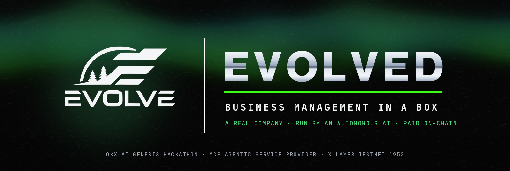
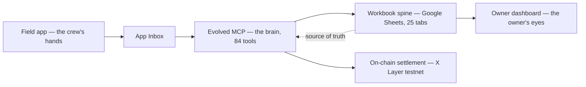

<div align="center">



### Most AI talks about business. Evolved runs one.

One agent takes **any** service business from a texted photo to a paid, on-chain invoice. **Free, open source (MIT), and adaptable to any trade in one call** — proven on a real Alberta company. 84 tools, live as an MCP service, with on-chain settlement on OKX X Layer testnet.

> **A complete business operating system — free, open source, for *any* company.** Not just an MCP server: four surfaces around one source of truth — the **MCP brain**, the **crew field app** (its hands), the **workbook spine**, and the **owner dashboard** (its eyes). Blasting is only the proving ground; `franchise_spinup` makes it any service business in one call. Pick your trade, generate your workbook, connect the app: **[docs/ONBOARDING.md](docs/ONBOARDING.md)**.

**▶ [TRY IT LIVE — the browser playground](https://www.evolvedmcp.cloud/)** — no install, no keys: run voice commands, photo-quote a driveway, drive the autonomous lifecycle through its two human money gates, and watch the x402 402 → proof → receipt flow, all against the real endpoint.

**🎬 The 90-second film** — every figure captured live from the endpoint ([notes + license](submission/DEMO-VIDEO.md)):

https://github.com/user-attachments/assets/ca858ecb-cf70-40d5-a1ac-54efef74f971

<sub>▶ Plays inline right here · also streaming at [www.evolvedmcp.cloud/demo.mp4](https://www.evolvedmcp.cloud/demo.mp4) · [full-quality file](submission/evolved-demo.mp4)</sub>

[](https://modelcontextprotocol.io)
[](https://www.okx.ai)
[](https://web3.okx.com/xlayer)
[](https://www.evolvedmcp.cloud/health)
[](docs/TOOLS.md)
[](#every-claim-is-tested)
[](LICENSE)

[Judge tour](#the-60-second-judge-tour) · [Why this wins](#why-this-wins) · [The lifecycle](#watch-one-agent-run-the-whole-engagement) · [On-chain](#paid-on-chain-okx-x-layer) · [Frontier](#the-frontier-set) · [84 tools](#the-tool-surface--84-tools-16-domains) · [Docs](docs/)

</div>

---

## Quick start — running in about 2 minutes

**Try it now, nothing to install:** open the live playground at **[www.evolvedmcp.cloud](https://www.evolvedmcp.cloud/)** and click Judge Mode.

**Run the MCP yourself** *(prerequisites: Node 20+ and git — nothing else, no keys, no accounts):*

```bash
git clone https://github.com/kr8tiv-ai/evolved.git && cd evolved
npm install && npm run build && npm run demo   # the business loop, narrated
```

**Wire it into your agent** — hosted (nothing to install) via the `mcp-remote` bridge:

```json
{ "mcpServers": { "evolved": { "command": "npx", "args": ["-y", "mcp-remote", "https://www.evolvedmcp.cloud/mcp"] } } }
```

Then ask it: *"Run the morning digest — what am I about to drop?"* Full client configs (Claude Desktop, Cursor, local stdio): [docs/CONNECT.md](docs/CONNECT.md). Make it **your** business in one call, then stand up the whole system (workbook, field app, dashboard): **[docs/STAND-UP-YOUR-OWN.md](docs/STAND-UP-YOUR-OWN.md)** — an afternoon for the MCP + workbook, a weekend for all four surfaces.

## The 60-second judge tour

The service is live. You can verify every headline claim from your terminal before reading another word.

```bash
# 1 · It exists, and it is an MCP service (10 seconds)
curl https://www.evolvedmcp.cloud/health

# 2 · It monetizes as an ASP — x402 pay-per-call (the 402 challenge, scheme "exact", eip155:1952)
curl -i -X POST https://www.evolvedmcp.cloud/mcp-paid \
  -H 'Content-Type: application/json' -H 'Accept: application/json, text/event-stream' \
  -d '{"jsonrpc":"2.0","id":1,"method":"initialize","params":{"protocolVersion":"2025-03-26","capabilities":{},"clientInfo":{"name":"judge","version":"1"}}}'

# 3 · Pay the challenge, get the service (settlement receipt in the X-PAYMENT-RESPONSE header)
#     (header is base64 of {"simulated":true} — quote-safe on every shell, incl. PowerShell)
curl -i -X POST https://www.evolvedmcp.cloud/mcp-paid \
  -H 'Content-Type: application/json' -H 'Accept: application/json, text/event-stream' \
  -H 'X-PAYMENT: eyJzaW11bGF0ZWQiOnRydWV9' \
  -d '{"jsonrpc":"2.0","id":1,"method":"initialize","params":{"protocolVersion":"2025-03-26","capabilities":{},"clientInfo":{"name":"judge","version":"1"}}}'

# 4 · The revenue scoreboard (paid calls + settlements, survives demo resets)
curl https://www.evolvedmcp.cloud/stats
```

Then run the whole company locally — no keys, no accounts, no funds:

```bash
git clone https://github.com/kr8tiv-ai/evolved.git && cd evolved
npm install && npm run build
npm test        # 51 tests — including a LIVE X Layer testnet probe
npm run demo    # the business loop, narrated in your terminal
```

## Why this wins

**Every "AI for business" demo is a chatbot wearing a suit. Evolved is a complete company operating system any service business can spin up in one call — and it is built from the operating system of a real one.** `franchise_spinup { tradePack: "pressure-washing" }` hands the whole machine to another trade in seconds; the credibility comes from Evolve Eco Blasting, the working Alberta abrasive-blasting company whose rates, GST and deposit policy, safety practice, and ball-drop rules run the demo — reimplemented, extended, and tested here. The demo dataset is synthetic; the math is not, and neither is the trade.

- **Any business, in one call.** `franchise_spinup` re-seeds the whole OS for a new trade with its own rate card, hazards, pricing unit (sqft / hour / unit / vehicle / flat), currency, and tax label (GST / VAT / Sales Tax) — a US or EU shop never touches the code. Proven on blasting; built for everyone.
- **Both OKX rails — and the paid one is opt-in.** Customer invoices settle in OKB on X Layer via EIP-681 requests verified by read-only RPC. The x402 pay-per-call tier is a **built-in rail any adopter can switch on** for their own deployment — off by default, never gating the free system. The on-chain integration judges score, without a toll on the open promise.
- **Autonomy with judgment.** One agent runs lead → e-sign → weather-gated booking → FLHA safety → books → invoice → on-chain settlement → review — and holds at exactly two human gates, both about money. Agentic where it should be, accountable where it must be.
- **It learns — and never stops.** Won jobs teach the rate engine (driveways converged to ~$9/sqft from outcome history), and every logged outcome now lifts a live **confidence** score and tightens the suggested quote range — more data, sharper quotes, on real or synthetic history alike. Each learned rate is **benchmarked against the market band** it derives from the trade's own card (`market_benchmark`, `pricing_learning_status`), so a quote is never blind; the books re-audit themselves daily; insight rankings train on the owner's feedback.
- **It is hardened, not vibed.** A documented adversarial review pass produced 29 confirmed findings — including on-chain replay protection and e-sign decline finality — every one fixed and regression-tested in [`f6acd80`](https://github.com/kr8tiv-ai/evolved/commit/f6acd80). A second security pass followed: the replay claim is now **atomic under concurrency** (a test drives the race), the rate limiter resolves the client IP through trusted-proxy hops instead of a spoofable header, `workbook_create` link-shares **read-only** by default, and the two dataset-replacing tools are fenced off the shared public endpoint. 51 tests pass, one live against X Layer testnet. Full model: [SECURITY.md](SECURITY.md).
- **Your books live in a real workbook.** The whole OS renders as an operations workbook — every collection a tab. `workbook_create` builds and syncs an actual **Google Sheets** workbook (service-account JWT, no SDK, no keys stored); `workbook_export` writes the identical 25 tabs as CSV with zero credentials. The spine the production company runs on, available to every adapted business.
- **It scales past one company.** `franchise_spinup` re-seeds the entire OS for any trade with a custom rate card in one call — `franchise_preview` window-shops it safely, `brand_configure` makes the rendered quotes feel like *your* company. Business management in a box is the product, not the tagline.

## One complete system — four surfaces, one brain

Evolved isn't just an MCP server — it's a complete, free, open-source operating system **any** service business can run, with four surfaces around a single source of truth:

- 🧠 **The MCP — the brain** *(this repo).* 84 tools that hold the business logic: pricing, safety, books, dispatch, on-chain settlement. Every other surface is a client of it. Clone, `npm install`, `npm run build`, zero credentials.
- ✋ **The field app — the crew's hands** — [kr8tiv-ai/evolve-field-app](https://github.com/kr8tiv-ai/evolve-field-app) (MIT). A worker taps one button in the truck — photo, receipt, FLHA sign-off, hazard, note — and it lands in the App Inbox for the brain to file. $0/month on Google Apps Script. Deployed and in daily production use, which is what makes the tool surface a description of real work rather than a design exercise. Everything queues except safety: `hazard_report` escalates immediately, and an uncleared **stop-work** outranks every money flag on the dispatch board. ([how it plugs in](docs/FIELD-APP.md))
- 📊 **The workbook — the spine** — the whole operation as a 25-tab Google Sheets workbook, created and synced by `workbook_create` or exported to CSV with zero credentials. One shared source of truth for the humans and the agent. ([generate your own](docs/ONBOARDING.md))
- 📈 **The dashboard — the owner's eyes, the administration surface.** A login-protected, mobile-responsive web app reading the same workbook — **live at [ops.evolveecoblasting.com](https://ops.evolveecoblasting.com)** (behind auth), source open-sourcing to `kr8tiv-ai/evolve-dashboard` (MIT): a finance dashboard with interactive charts (spend proportion, revenue and margin trends, job-profitability comparison); job P&Ls, quotes, invoices, and receivables with every entity clickable through to its document; filterable receipts with pop-up images; an insights page (last month's revenue, where the money went, margin trends, outstanding receivables); a safety page (FLHAs, mitigations, worker sign-offs — audit-ready); a maintenance page (servicing, wear items, overdue work); and a company inventory page tied to a materials price tracker. Same dark aurora branding. Read-only onto the spine — it shows, the brain does. ([how it plugs in](docs/DASHBOARD.md))



**Stand up the whole thing for your own company** — your workbook, your router, your field app, your dashboard, your MCP, nothing of Evolve's: **[docs/STAND-UP-YOUR-OWN.md](docs/STAND-UP-YOUR-OWN.md)**. The MCP + workbook is an afternoon; adding the crew and owner surfaces is a weekend. Every piece is MIT, free, and optional.

### Every repo in the system

Open source, all MIT — the system reads as one thing from whichever repo you land on first. How the four surfaces actually integrate (the shared workbook spine, the two auth paths, and an honest verified-vs-aspirational status): **[docs/INTEGRATION.md](docs/INTEGRATION.md)**.

| Repo / surface | Role | Link |
|---|---|---|
| **evolved** | 🧠 The MCP brain — 84 tools, the workbook spine, the on-chain rail, the trade packs (this repo) | [kr8tiv-ai/evolved](https://github.com/kr8tiv-ai/evolved) |
| **evolve-field-app** | ✋ The crew's hands — tap-once field capture, $0/month on Apps Script | [kr8tiv-ai/evolve-field-app](https://github.com/kr8tiv-ai/evolve-field-app) |
| **evolve-ops-workbook** | 📊 The spine — a 25-tab workbook template + the secret-gated Apps Script router the human surfaces read through (generate your own secret) | [kr8tiv-ai/evolve-ops-workbook](https://github.com/kr8tiv-ai/evolve-ops-workbook) · in-repo: [`make-workbook-template.mjs`](scripts/make-workbook-template.mjs) · [`router.gs`](templates/router.gs) |
| **evolve-dashboard** | 📈 The owner's eyes — login-protected finance/ops dashboard (runs credential-free in demo mode), live at [ops.evolveecoblasting.com](https://ops.evolveecoblasting.com) | [kr8tiv-ai/evolve-dashboard](https://github.com/kr8tiv-ai/evolve-dashboard) · [docs/DASHBOARD.md](docs/DASHBOARD.md) |
| **evolvedmcp-cloud** | 🌐 The landing page + zero-install Judge-Mode playground (the site at www.evolvedmcp.cloud) | [kr8tiv-io/evolvedmcp-cloud](https://github.com/kr8tiv-io/evolvedmcp-cloud) |

Related Evolve-brand repos: [kr8tiv-io/Evolve-Rebrand](https://github.com/kr8tiv-io/Evolve-Rebrand) (the identity system) and [kr8tiv-io/evolve-lifestyle](https://github.com/kr8tiv-io/evolve-lifestyle) (the apparel arm) — the brand this operating system runs under.

### Stand up your own — the five steps

Full guide with commands and effort estimates: **[docs/STAND-UP-YOUR-OWN.md](docs/STAND-UP-YOUR-OWN.md)**. In short:

1. **Your ops workbook** *(required, ~10 min)* — `node scripts/make-workbook-template.mjs <trade> "My Company"` → import the 20 CSV tabs into a Google Sheet.
2. **Your MCP** *(required, ~20 min)* — clone this repo, point any MCP client at it ([CONNECT.md](docs/CONNECT.md)), and `franchise_spinup` your trade. You now have an agent-run business.
3. **Your router** *(optional, ~30 min)* — deploy the Apps Script router from [evolve-ops-workbook](https://github.com/kr8tiv-ai/evolve-ops-workbook) ([`router.gs`](templates/router.gs)) as a web app with your **own** generated secret; the field app and dashboard read through it.
4. **Your field app** *(optional, ~20 min)* — deploy [evolve-field-app](https://github.com/kr8tiv-ai/evolve-field-app), point it at your router.
5. **Your dashboard** *(optional, ~30 min)* — deploy [evolve-dashboard](https://github.com/kr8tiv-ai/evolve-dashboard) (it runs credential-free in demo mode first — `npm install && npm start`), then point it at your router and set your own login.

The MCP + workbook is an afternoon; adding the crew and owner surfaces is a weekend. Everything is optional and independent — stop after any step.

Four surfaces, one loop, all open source and free — and it begins at the MCP. The brain runs the company; the field app, the workbook, and the dashboard are how real people touch the same system. **Blasting is just the proving ground — `franchise_spinup` makes it any service business in one call.**

## Watch one agent run the whole engagement

```mermaid
flowchart LR
    A["Lead — typed, voice, or photo"] --> B["Priced quote — learning rates + profitability check"]
    B --> G1{{"HUMAN GATE: approve the quote"}}
    G1 --> C["E-sign — HMAC token, declines are final"]
    C --> D["Booked on the first good blast day — weather-gated"]
    D --> E["FLHA drafted — hazards + mitigations from scope"]
    E --> F["Work done — actuals, inventory burn-down, receipts"]
    F --> H["Invoice — deposit applied"]
    H --> I["On-chain payment — EIP-681 on X Layer testnet, replay-protected"]
    I --> G2{{"HUMAN GATE: confirm settlement"}}
    G2 --> J["Review request + rate engine taught"]
    J -.->|smarter pricing| B
```

<div align="center">

</div>



Every step lands in an audit log. Try it through any MCP client: `lifecycle_start`, then `lifecycle_advance { approveQuote: true, esignSigner: "..." }`, then `lifecycle_advance { simulatePayment: true }` — or hand it a real X Layer testnet `txHash` and watch the read-only RPC verification confirm it.

## Paid on-chain (OKX X Layer)

### Why on-chain matters *here* — not as a bolt-on

A blasting crew buys media and fuel **before the first grain hits the driveway**. A trades business lives or dies on cash flow and finality, and that is exactly what on-chain settlement fixes:

- **Instant.** The deposit clears in seconds — not a 3-day e-transfer hold or a 30-day net invoice. The abrasive and fuel get funded *today*, so the agent can book the crew now.
- **Final.** No chargebacks. A card can reverse weeks later, after the media is already blasted onto someone's concrete and the cost is sunk. On-chain, paid is paid.
- **Programmable.** The 25% deposit is enforced in code and encoded into the EIP-681 request (`invoice_payment_request { split: "deposit" }`) — not a number a human has to remember to collect.
- **Self-verifying.** The agent confirms the money landed itself via read-only RPC before it commits the crew — no waiting on a person to check the bank.

For a cash-tight trade, that is not a feature. It is the difference between taking the job and turning it down.

**TESTNET ONLY — and Evolved never holds keys, never signs, never broadcasts.** It issues payment requests and verifies settlement with read-only RPC; funds can only move from the payer's own wallet, and replay protection guarantees one transaction settles exactly one thing.

| Rail | What happens |
|---|---|
| **SMB invoices settle on-chain** | `invoice_payment_request` converts a balance due into an EIP-681 URI in test OKB on chainId **1952** (Terigon). `invoice_payment_check` verifies the transaction on-chain — exists, succeeded, right recipient, sufficient value, never used before — then flips the invoice and job to Paid. `xlayer_status` proves the rail is live RPC, not a mock. |
| **Built-in x402 rail (opt-in)** | A rail any adopter can switch on for their own deployment: `POST /mcp-paid` answers `402 Payment Required` with a spec-shaped `accepts` envelope (scheme `exact`, network `eip155:1952`, base64 copy in the `PAYMENT-REQUIRED` header) until proof arrives in the `X-PAYMENT` header; settled calls carry an `X-PAYMENT-RESPONSE` receipt. It's the on-chain billing integration, off by default — the free A2MCP tier at `POST /mcp` is the real system and always free. |

Simulated mode is the default so judges can run everything offline, and every simulated settlement says so; `EVOLVED_X402_MODE=live` fails closed and demands real testnet transactions. Full protocol detail: [docs/ONCHAIN.md](docs/ONCHAIN.md). Pinning your own real testnet settlements is a two-command runbook: [docs/GO-LIVE-ONCHAIN.md](docs/GO-LIVE-ONCHAIN.md).

## The frontier set

| | |
|---|---|
| **📸 Photo-to-quote** | A customer texts a photo; `quote_from_photo` estimates surface, area, condition, and blast depth (Claude vision with a key, or a deterministic offline estimator that parses real JPEG/PNG headers), then hands back what a seasoned estimator would — a **confidence-banded price range** (not a blind number), the **comparable jobs already in the books** it's grounded in, a market benchmark, and the exact site factors that could move it — before booking a branded draft with a measure-to-confirm clause. Absurd dimensions are clamped, not passed through. Seconds, not site visits. |
| **🎙️ Voice field commands** | "Used four bags of crushed glass on the Kowalczyk job" burns down inventory against that job's P&L. "Open the FLHA" drafts the day's hazard assessment. "Next stop?" reads the dispatch board. Unmatched job hints refuse rather than guess, and unrecognized speech is captured to the inbox — nothing is lost, nothing is misfiled. |
| **📈 Agentic CFO** | `cfo_forecast` answers add-a-truck (capex, utilization ramp, break-even month), rate changes (with price elasticity), and demand shocks with a 12-month cash table grounded in the books, weather-gated seasonality, and every assumption stated. `cfo_health` is the one-pager an owner actually needs. |
| **📦 Franchise spin-up** | `franchise_spinup` re-seeds the entire OS for a new company in a different trade — name, rate card, region — empty books, full machinery: quoting, receipts, FLHA, digest, learning loop, on-chain invoicing. One company's operating system becomes anyone's. |

## Make it yours — an adaptable toolkit, not a one-off

The company is swappable — and not just its name. `franchise_spinup { tradePack: "pressure-washing", confirm: true }` re-seeds the entire OS for another trade: its own rate card in the quoting engine, **its own hazards in every FLHA the system drafts**, its **pricing unit** (`sqft` / `hour` / `unit` / `vehicle` / flat — a detailer prices per vehicle, not "per 100 sqft of car"), its **currency and tax label** (`GST` / `VAT` / `HST` / `Sales Tax` — a US or EU shop never forks the code), and its own policy notes (no blasting boilerplate leaks in). Three packs ship today (`pressure-washing`, `line-painting`, `mobile-detailing`); add yours as one entry in [`src/trades.ts`](src/trades.ts) — or pass a whole `customPack` (labels + hazards) **inline in one call, no fork**. Full turnkey path: **[docs/ONBOARDING.md](docs/ONBOARDING.md)**. And the server speaks the whole MCP spec, not just tools: **resources** (`evolved://rate-table`, `evolved://hazard-library`, `evolved://trade-packs`) and **prompts** (`morning-briefing`, `quote-a-job`, `run-the-lifecycle`) come built in, so any MCP client gets one-line entry points. The 10-minute adaptation guide: [docs/ADAPT.md](docs/ADAPT.md). Security posture and threat model: [SECURITY.md](SECURITY.md).

## Full parity with the production system

Everything the live field app and ops workbook do, as first-class tools: **inventory control** (par levels, reorder suggestions priced from real COD receipts, per-job burn-down, supplier price-spike watch), **contacts/CRM** (customers with balances, suppliers with pricebooks, crew with certifications), **the ops-sheet engine** (the data spine rendered as the operations workbook — the field App Inbox with a deterministic filing engine), **accounting depth** (tiered-OCR receipts with vendor canonicalization and duplicate guards, discrepancy reports, escalating receivables reminders, P&L with reclaimable GST), **the workbook spine** (a real Google Sheets workbook created and synced from the database, or the same 25 tabs as CSV with zero credentials), **field operations** (before/after photo albums with gap detection, voice and text field notes that never get lost, a crew time clock that feeds real labor cost into Job P&L, and hazard assessments authored ON-SITE by the crew — auto-drafts are only starting points), and **growth** (review requests with a tracked response rate, the reputation ledger and testimonial bank, the Job P&L scorecard with win rate and overall margin, and the live dispatch board).

## Everything it does — the full capability set

A reader should finish this knowing exactly what the system runs, not a teaser. All 84 tools, grouped by what they do for a business:

- **Quoting intelligence** — price any job with a rate engine that *learns*: a $/unit rate per tier that converges toward what actually wins work at healthy margins, a confidence score and a suggested price range that tightens with data, a market-band benchmark so a quote is never blind, and a full profitability check (media, labour, fuel, overhead, break-even rate, margin verdict). Create the quote, render the branded document, track its status, and teach the engine from the outcome.
- **Photo-to-quote** — a customer texts a photo; the system estimates surface, area, condition, and tier, then returns a confidence-banded price range grounded in comparable jobs already in the books, a market benchmark, and the site factors that could move it — before booking a branded draft with a measure-to-confirm clause.
- **Invoicing & receivables** — turn a job into an invoice with the deposit applied, render it, chase it: escalating reminders, receivables aging, and a running balance-due per customer.
- **Receipts → books** — ingest a receipt through tiered OCR (escalates the hard ones), reconcile subtotal + tax = total, categorise it, canonicalise the vendor, guard against duplicates, and roll it into expenses, per-job cost, and the P&L (with reclaimable tax broken out).
- **Job & lead tracking** — a full pipeline (lead → contacted → quoted → won/lost), a dispatch board bucketed by real job statuses with today's work and unscheduled-but-paid flags, and job scheduling/completion with actuals capture.
- **Inventory control** — media, coatings, PPE, and consumables on hand with par levels and reorder points, per-job burn-down, receive-against-receipt, reorder suggestions priced from real purchase history, and a supplier price-spike watch.
- **Contacts / CRM** — customers with balances, suppliers with pricebooks, and crew with certifications and hourly rates.
- **Safety & FLHA** — draft the day's field-level hazard assessment from the job scope with per-hazard mitigations and standard PPE, capture it on-site, sign it off per worker, and escalate a hazard immediately — an uncleared stop-work outranks every money flag on the board. Audit-ready records.
- **Dispatch & the daily loop** — a morning digest that leads with the one thing not to drop, then money pulse, today's jobs, leads, and quotes out; an action-item "ball-drop" scanner (deposit in but unscheduled, invoice unpaid, quote expiring, job done but not invoiced); a weather-gated booking check; and a live business snapshot.
- **CFO forecasting** — model add-a-truck (capex, utilisation ramp, break-even month), rate changes with price elasticity, and demand shocks over a 12-month cash table grounded in the books and weather-gated seasonality; plus a financial-health one-pager (receivables aging, customer-concentration risk, run-rate).
- **Field operations** — before/after photo albums with gap detection, voice and text field notes that never get lost, a crew time clock that feeds real labour cost into Job P&L, and JHAs authored on-site.
- **Voice commands** — "used four bags of crushed glass on the Kowalczyk job" burns down inventory against that job; "open the FLHA" drafts the hazard assessment; "next stop?" reads the dispatch board. Unmatched job hints refuse rather than guess.
- **Growth** — post-job review requests with a tracked response rate, a reputation ledger and testimonial bank, and a Job P&L scorecard (quoted vs actual, win rate, overall margin, average $/unit).
- **On-chain settlement** — turn an invoice into an EIP-681 payment request in test OKB on OKX X Layer, verify settlement with read-only RPC (replay-protected, never holds keys), and monetise the agent itself with an opt-in x402 pay-per-call rail.
- **The workbook spine** — render the whole operation as a real Google Sheets workbook (created and synced via service account) or the identical 25 tabs as a zero-credential CSV bundle.
- **Business-in-a-box & trade packs** — `franchise_spinup` re-seeds the entire OS for any trade in one call (rate card, hazards, pricing unit, currency, tax label, policy notes), `franchise_preview` window-shops a pack safely, `brand_configure` makes rendered documents feel like your company, and daily insights train on the owner's feedback. Backups, activity feed, and demo reset round it out.

Named-tool reference below; full parameter-level docs (generated from the live server so they can't drift): [docs/TOOLS.md](docs/TOOLS.md).

## The tool surface — 84 tools, 16 domains

| Domain | Tools |
|---|---|
| **Quoting intelligence** | `quote_price` · `quote_create` · `quote_render` · `quote_update_status` · `quote_list` · `pricing_rates` · `pricing_record_outcome` · `market_benchmark` · `pricing_learning_status` |
| **Money** | `receipt_ingest` · `expense_report` · `invoice_create` · `invoice_render` · `pnl_report` |
| **Pipeline** | `lead_capture` · `lead_update` · `pipeline_view` · `job_schedule` · `job_complete` · `customer_list` |
| **Safety (FLHA)** | `flha_open` · `flha_signoff` · `hazard_report` · `safety_log` |
| **Autonomous ops** | `morning_digest` · `action_items_scan` · `action_item_resolve` · `weather_check` · `business_snapshot` · `demo_reset` |
| **Inventory control** | `inventory_status` · `inventory_receive` · `inventory_consume` · `inventory_reorder_suggestions` · `price_watch` |
| **Contacts / CRM** | `contact_search` · `supplier_add` · `supplier_pricebook` · `crew_add` · `crew_roster` |
| **Ops-sheet engine** | `sheet_tabs` · `sheet_read` · `sheet_append_todo` · `inbox_submit` · `inbox_list` · `inbox_file` |
| **Accounting depth** | `vendor_rollup` · `receipt_report` · `invoice_remind` |
| **On-chain (X Layer testnet)** | `invoice_payment_request` · `invoice_payment_check` · `xlayer_status` · `x402_info` |
| **Autonomous lifecycle** | `lifecycle_start` · `lifecycle_advance` · `lifecycle_status` · `quote_esign_sign` · `review_record` |
| **Frontier** | `quote_from_photo` · `voice_command` · `cfo_forecast` · `cfo_health` |
| **Business-in-a-box** | `insights_generate` · `insight_feedback` · `activity_feed` · `backup_create` · `backup_list` · `franchise_spinup` |
| **Workbook spine** | `workbook_create` · `workbook_sync` · `workbook_link` · `workbook_export` · `workbook_status` |
| **Field ops** | `field_photo_log` · `field_note` · `crew_checkin` · `crew_checkout` · `flha_field_capture` |
| **Growth** | `review_request` · `reputation_report` · `job_pnl_report` · `dispatch_board` · `brand_configure` · `franchise_preview` |

Parameter-level reference, generated from the live server so it cannot drift: [docs/TOOLS.md](docs/TOOLS.md).

## The scaffolding

Three layers, dependencies pointing one way: tools validate and delegate, engines compute, the store persists. Swap the trade pack and every layer follows.

```text
src/
├── index.ts            stdio entry — plug into Claude Desktop / any MCP client
├── http.ts · app.ts    Streamable HTTP: /mcp (free) · /mcp-paid (x402) · /health · /stats
├── server.ts           assembles all 84 tools + 4 MCP resources + 3 prompts
├── playground.ts       the zero-install browser playground (Judge Mode lives here)
├── tools/              16 domains — thin, zod-validated handlers (quoting, money, pipeline,
│                       safety, inventory, contacts, sheet, accounting, payments, lifecycle,
│                       vision, voice, cfo, ops, opsplus, workbook, field, growth)
├── engine/             pure business logic — pricing + learning loop, OCR, safety/FLHA,
│                       weather gating, digest, actions (ball-drop rules), CFO, NLU (voice),
│                       vision, x402/X Layer payments, brand rendering, and the Google
│                       Sheets workbook spine (service-account JWT via node:crypto, no SDK)
├── trades.ts           trade packs — the one file you touch to adapt Evolved to your trade
├── seed.ts · store.ts  synthetic workbook-shaped data spine (JSON, git-ignored at runtime)
└── test/               51 tests — engines, E2E lifecycle, x402 over HTTP, live testnet probe
```

## Wire it into your agent — ~30 seconds

**Hosted, nothing to install** — point any MCP client at the live server through the `mcp-remote` bridge:

```json
{ "mcpServers": { "evolved": { "command": "npx", "args": ["-y", "mcp-remote", "https://www.evolvedmcp.cloud/mcp"] } } }
```

**Local, fully offline** (after `git clone … && npm install && npm run build`):

```json
{ "mcpServers": { "evolved": { "command": "node", "args": ["<path-to>/evolved/dist/index.js"] } } }
```

Works with Claude Desktop, Claude Code, Cursor, OpenClaw, Hermes, Codex — anything that speaks MCP. Every tool ships MCP **annotations** (`readOnlyHint` / `destructiveHint` / `openWorldHint`) so your client knows what's safe to call before it calls it. Full copy-paste guide for each client: **[docs/CONNECT.md](docs/CONNECT.md)**. HTTP mode (`npm run start:http`) serves the free tier at `POST /mcp`, the x402 tier at `POST /mcp-paid`, and `GET /health`. Optional live upgrades: `ANTHROPIC_API_KEY` (real vision and OCR escalation), `EVOLVED_LIVE_WEATHER=1` (real forecasts), `EVOLVED_X402_MODE=live` (require real testnet transactions), `EVOLVED_PAYTO=0x…` (your testnet receiving address).

Then ask it things a business owner would:

> "Run the morning digest. What am I about to drop?"
> "A property manager wants a 2,100 sqft parkade level profiled, tight access — price it, and if the margin is healthy, create the quote and render the document."
> "Should I buy a second truck this fall?"

## Every claim is tested

```bash
npm test
# ✔ pricing: learning loop pulls driveway medium toward ~$9/sqft, never below base
# ✔ ocr: comma thousands-separator regression (the production P0 bug)
# ✔ autonomous lifecycle: lead → e-sign → weather booking → FLHA → invoice → on-chain settle → review → learning
# ✔ x402 over real HTTP: 402 challenge, then simulated proof unlocks the MCP surface
# ✔ X Layer testnet RPC: live read-only probe (chainId 1952 asserted)
# ✔ review fixes: replay protection, declined e-sign is final, custom price break-even flag
# ✔ franchise spin-up re-seeds the OS for a new trade
# ✔ pricing: confidence rises with data, quote range tightens, market benchmark flags under/over
# ✔ workbook: 25 tabs cover the whole OS; CSV export writes real files; no-creds create falls back
# ✔ field ops: photo album gaps, note routing to the inbox, time clock feeds Job P&L labor
# ✔ safety: the JHA is authored on-site — field capture creates or upgrades the day's FLHA
# ✔ growth: review loop, reputation ledger, dispatch board flags, brand config, pack preview
# ✔ security: replay claim is atomic under concurrency; destructive tools fenced off the shared endpoint
# ✔ adaptability: an inline trade pack spins up a new trade; an adapted trade quotes in its own unit (per vehicle, not sqft)
# ✔ workbook drives the admin dashboard: 25 tabs, all 17 dashboard entities verified end-to-end
# ✔ resilience: bounded mkdir cannot busy-loop; digest surfaces to-dos; sheet engine mirrors all 25 tabs
# … 51 passing
```

The battle scars are real and documented: the production receipt parser once read a $1,250 media invoice as $1.25 — that comma bug is fixed here and pinned by regression tests, along with 28 other adversarial-review findings shipped in [`f6acd80`](https://github.com/kr8tiv-ai/evolved/commit/f6acd80) (replay protection, decline finality, break-even flagging, and the long tail). Architecture, data model, and production lineage: [docs/ARCHITECTURE.md](docs/ARCHITECTURE.md).

## Who built this

**[Matt Haynes](https://www.linkedin.com/in/matthaynes88)** — Operations & Marketing Manager at [Evolve Eco Blasting](https://www.evolveecoblasting.com) and founder of **KR8TIV AI** (Edmonton, Alberta). Not a lab researcher — a real-world operator who runs the back office of a mobile abrasive-blasting crew *and* builds the AI that runs it. Evolved is the portable, open-source form of that system: after a live field app ([kr8tiv-ai/evolve-field-app](https://github.com/kr8tiv-ai/evolve-field-app)), an ops workbook, and a full rebrand, reimagined as an MCP service any trade can install in one call.

> *"You give to get. You work something out, and you leave the gate open for the next person."*

That conviction is why Evolved is MIT and free. On the roadmap: stronger back-office systems, robotics to make the hardest jobsite work safer, and manufacturing beyond.

**With Todd** — owner-operator of Evolve Eco Blasting — whose real company, real rates, real safety practice, and real ball-drop rules are the production truth the entire demo runs on. Evolved isn't a hypothetical; it's the software a working crew uses, made portable for everyone.

<sub>[github.com/Matt-Aurora-Ventures](https://github.com/Matt-Aurora-Ventures) · [linkedin.com/in/matthaynes88](https://www.linkedin.com/in/matthaynes88) · [kr8tiv.io](https://www.kr8tiv.io) · Edmonton, Alberta 🇨🇦</sub>

## The submission

Built for the **OKX AI Genesis Hackathon** by [Matt Haynes](https://github.com/Matt-Aurora-Ventures) (KR8TIV AI) from the live operations system of [Evolve Eco Blasting](https://www.evolveecoblasting.com), July 2026.

| | |
|---|---|
| **Try it live** | [www.evolvedmcp.cloud](https://www.evolvedmcp.cloud/) — browser playground, zero install |
| **Stand up your own** | [docs/STAND-UP-YOUR-OWN.md](docs/STAND-UP-YOUR-OWN.md) — the whole system for your company (afternoon → weekend) · quick path: [ONBOARDING.md](docs/ONBOARDING.md) |
| **The four surfaces** | 🧠 MCP (this repo) · ✋ [field app](https://github.com/kr8tiv-ai/evolve-field-app) ([docs](docs/FIELD-APP.md)) · 📊 [workbook](docs/ONBOARDING.md) + [router template](templates/router.gs) · 📈 dashboard ([ops.evolveecoblasting.com](https://ops.evolveecoblasting.com), [docs](docs/DASHBOARD.md)) |
| **Connect your agent** | [docs/CONNECT.md](docs/CONNECT.md) — copy-paste config for Claude Desktop, Claude Code, Cursor (hosted or local) |
| Live endpoint | `/mcp` (free A2MCP) · `/mcp-paid` (x402) · `/health` · `/stats` (revenue scoreboard) |
| Listing | A2MCP ASP with an implemented x402 paid tier — [docs/OKX-LISTING.md](docs/OKX-LISTING.md) |
| Demo script | Two-act 90-second cut — [docs/DEMO.md](docs/DEMO.md) |
| **Demo video** | [submission/evolved-demo.mp4](submission/evolved-demo.mp4) — 90s, 1080p, on-brand, captioned, royalty-free funk soundtrack ([notes](submission/DEMO-VIDEO.md)) — streams from the live deployment at [/demo.mp4](https://www.evolvedmcp.cloud/demo.mp4) |
| Categories | Best Product · Revenue Rocket · Software Utility · Finance Copilot |

MIT licensed. Synthetic data only; testnet only; no secrets anywhere in this repository. Evolved never holds keys and cannot move funds — by construction.

<div align="center">
<br>
<code>OKX AI GENESIS · MCP AGENTIC SERVICE PROVIDER · X LAYER TESTNET 1952 · BUILT ON A REAL JOBSITE</code>
<br><br>
</div>
