<div align="center">


<br>

**The complete operations brain of a working industrial-services company — now with on-chain settlement — packaged as an agentic service.**

[](https://modelcontextprotocol.io)
[](https://www.okx.ai)
[](https://web3.okx.com/xlayer)
[](docs/TOOLS.md)
[](#verify-it-yourself)
[](LICENSE)

[Why](#why-this-exists) · [The lifecycle](#one-agent-runs-the-whole-engagement) · [On-chain](#paid-on-chain-okx-x-layer) · [Frontier](#the-frontier-set) · [Tools](#the-tool-surface--65-tools-13-domains) · [Quickstart](#quickstart) · [Docs](docs/)

</div>

---

## Why this exists

Most "AI for business" demos are chatbots wearing a suit. **Evolved is the actual operating system of Evolve Eco Blasting, a real abrasive-blasting company in Edmonton, Alberta** — the system that already prices driveways, catches receipts from truck cabs, and emails the owner a 6:30 AM digest — re-engineered as a Model Context Protocol server any agent can drive, and extended with the piece every small business is missing: **getting paid on-chain, autonomously, with humans approving only the money.**

The demo dataset is fully synthetic. The math, the rules, the safety practice, and the workflow are the real ones a real company runs on.

## One agent runs the whole engagement

`lifecycle_start` + `lifecycle_advance` drive an entire job with **human gates at exactly two places — both about money**:

```mermaid
%%{init: {"theme": "dark", "themeVariables": {"primaryColor": "#101010", "primaryBorderColor": "#4ade80", "primaryTextColor": "#f3f4f6", "lineColor": "#4ade80", "fontFamily": "Segoe UI"}}}%%
flowchart LR
    A[Lead<br><i>typed, voice,<br>or photo</i>] --> B[Priced quote<br><i>learning rates +<br>profitability check</i>]
    B --> G1{{"🔒 HUMAN GATE<br>approve the quote"}}
    G1 --> C[E-sign<br><i>HMAC token,<br>timestamped</i>]
    C --> D[Booked on the first<br>Good blast day<br><i>weather-gated</i>]
    D --> E[FLHA drafted<br><i>hazards + mitigations<br>from scope</i>]
    E --> F[Work done<br><i>actuals, inventory<br>burn-down, receipts</i>]
    F --> H[Invoice<br><i>deposit applied</i>]
    H --> I[On-chain payment<br><i>EIP-681 on X Layer<br>testnet</i>]
    I --> G2{{"🔒 HUMAN GATE<br>confirm settlement"}}
    G2 --> J[Review request +<br>rate engine taught]
    J -.->|smarter pricing| B
```



Every step is logged to an audit trail. Try it in one minute:

```
lifecycle_start    → creates lead, prices 520 sqft at learned rates, drafts the quote, HOLDS at the money gate
lifecycle_advance  { approveQuote: true, esignSigner: "Dr. A. Ridge" }
                   → e-signs, books the first Good blast day, drafts the FLHA, completes with actuals,
                     burns down media inventory, invoices, issues the on-chain payment request, HOLDS
lifecycle_advance  { simulatePayment: true }   (or txHash: "0x…" against the real testnet)
                   → settles, requests the review, teaches the rate engine, closes
```

## Paid on-chain (OKX X Layer)

**TESTNET ONLY — and Evolved never holds keys, never signs, never broadcasts.** It issues payment requests and verifies settlement with read-only RPC; money can only move from the payer's own wallet.

Two rails, both real:

**1. SMB invoices settle on-chain.** `invoice_payment_request` turns any invoice's balance into an EIP-681 payment URI on X Layer testnet (chainId **1952**, Terigon); `invoice_payment_check` verifies the transaction on-chain — exists, succeeded, right recipient, sufficient value — then flips the invoice and job to Paid. `xlayer_status` proves the rail is live RPC, not a mock.

**2. Evolved itself is a paid ASP via x402.** The HTTP server exposes `POST /mcp` (free A2MCP tier) and `POST /mcp-paid` (x402 pay-per-call):

```bash
curl -i -X POST http://localhost:3000/mcp-paid -H 'Content-Type: application/json' -d '…MCP request…'
# → HTTP/1.1 402 Payment Required
# → PAYMENT-REQUIRED: <base64 envelope>
# → {"x402Version":1,"accepts":[{"scheme":"exact","network":"eip155:1952", …}]}

curl -i -X POST http://localhost:3000/mcp-paid \
  -H 'X-PAYMENT: {"txHash":"0x…"}' … # live testnet verification (or {"simulated":true} in demo mode)
# → HTTP/1.1 200 + X-PAYMENT-RESPONSE: <base64 settlement receipt> + the MCP response
```

Simulated mode is the default so the whole demo runs offline and is always labeled as simulated; `EVOLVED_X402_MODE=live` fails closed and requires real testnet transactions.

## The frontier set

- **📸 Photo-to-quote** — a customer texts a photo; `quote_from_photo` estimates surface, area, condition, and blast depth (Claude vision with a key, or a deterministic offline estimator that parses real JPEG/PNG headers), prices it through the learning engine with a margin verdict, and books a branded draft quote with a measure-to-confirm clause. Seconds, not site visits.
- **🎙️ Voice field commands** — "used four bags of crushed glass on the Kowalczyk job" decrements inventory against that job's P&L. "Open the FLHA" drafts the day's hazard assessment. "Next stop?" reads the dispatch board. Anything unrecognized is captured to the App Inbox — no thought is ever lost.
- **📈 Agentic CFO** — `cfo_forecast` answers add-a-truck (capex, utilization ramp, break-even month), rate changes (with price elasticity), and demand shocks with a 12-month cash table grounded in the actual books, weather-gated seasonality, and every assumption stated. `cfo_health` is the one-pager: receivables aging, concentration risk, reorder alerts, reputation.
- **📦 Business-in-a-box, literally** — `franchise_spinup` re-seeds the entire OS for a *new company in a different trade* — name, rate card, region — with empty books and all machinery intact: quoting, receipts, FLHA, digest, learning loop, on-chain invoicing. One company's operating system becomes anyone's.

## Full parity with the production system

Everything the live field app does, as first-class tools: **inventory control** (par levels, reorder suggestions priced from real COD receipts, per-job burn-down, supplier price-spike watch), **contacts/CRM** (customers, suppliers with pricebooks, crew with certifications), **the ops-sheet engine** (the data spine rendered as the operations workbook — 14 tabs, append-only discipline, and the field App Inbox with a deterministic filing engine), and **accounting depth** (tiered-OCR receipts with vendor canonicalization and duplicate guards, discrepancy reports, escalating receivables reminders, P&L, GST tracking).

## The tool surface — 65 tools, 13 domains

| Domain | Tools |
|---|---|
| **Quoting intelligence** | `quote_price` · `quote_create` · `quote_render` · `quote_update_status` · `quote_list` · `pricing_rates` · `pricing_record_outcome` |
| **Money** | `receipt_ingest` · `expense_report` · `invoice_create` · `invoice_render` · `pnl_report` |
| **Pipeline** | `lead_capture` · `lead_update` · `pipeline_view` · `job_schedule` · `job_complete` · `customer_list` |
| **Safety (FLHA)** | `flha_open` · `flha_signoff` · `safety_log` |
| **Autonomous ops** | `morning_digest` · `action_items_scan` · `action_item_resolve` · `weather_check` · `business_snapshot` · `demo_reset` |
| **Inventory control** | `inventory_status` · `inventory_receive` · `inventory_consume` · `inventory_reorder_suggestions` · `price_watch` |
| **Contacts / CRM** | `contact_search` · `supplier_add` · `supplier_pricebook` · `crew_add` · `crew_roster` |
| **Ops-sheet engine** | `sheet_tabs` · `sheet_read` · `sheet_append_todo` · `inbox_submit` · `inbox_list` · `inbox_file` |
| **Accounting depth** | `vendor_rollup` · `receipt_report` · `invoice_remind` |
| **On-chain (X Layer testnet)** | `invoice_payment_request` · `invoice_payment_check` · `xlayer_status` · `x402_info` |
| **Autonomous lifecycle** | `lifecycle_start` · `lifecycle_advance` · `lifecycle_status` · `quote_esign_sign` · `review_record` |
| **Frontier** | `quote_from_photo` · `voice_command` · `cfo_forecast` · `cfo_health` |
| **Business-in-a-box** | `insights_generate` · `insight_feedback` · `activity_feed` · `backup_create` · `backup_list` · `franchise_spinup` |

Parameter-level reference (generated from the live server): [docs/TOOLS.md](docs/TOOLS.md).

## Quickstart

```bash
git clone https://github.com/kr8tiv-ai/evolved.git
cd evolved
npm install
npm run build
npm test        # 30 tests: engines, full-loop E2E, lifecycle, x402 over HTTP, live testnet probe
npm run demo    # the classic 10-beat business loop in your terminal
```

**Claude Desktop / Claude Code / any MCP client (stdio):**

```json
{ "mcpServers": { "evolved": { "command": "node", "args": ["<path-to>/evolved/dist/index.js"] } } }
```

**HTTP (A2MCP free tier + x402 paid tier):** `npm run start:http` → `POST /mcp`, `POST /mcp-paid`, `GET /health` on port 3000.

No API keys, accounts, or funds required — everything runs offline on synthetic data. Optional live upgrades: `ANTHROPIC_API_KEY` (real vision + OCR escalation), `EVOLVED_LIVE_WEATHER=1` (real forecasts), `EVOLVED_X402_MODE=live` (require real X Layer testnet transactions), `EVOLVED_PAYTO=0x…` (your testnet receiving address).

## Verify it yourself

```bash
npm test
# ✔ pricing: learning loop pulls driveway medium toward ~$9/sqft, never below base
# ✔ ocr: comma thousands-separator regression (the production P0 bug)
# ✔ autonomous lifecycle: lead → e-sign → weather booking → FLHA → invoice → on-chain settle → review → learning
# ✔ x402 over real HTTP: 402 challenge, then simulated proof unlocks the MCP surface
# ✔ X Layer testnet RPC: live read-only probe (chainId 1952 asserted)
# ✔ franchise spin-up re-seeds the OS for a new trade
# … 30 passing
```

## Architecture, lineage, and battle scars

Design notes, the data model, production lineage (what maps to the live Google Sheets workbook and Apps Script autopilot), and the real production bugs fixed and regression-tested here (including the comma bug that undercounted a $1,250 receipt as $1.25): [docs/ARCHITECTURE.md](docs/ARCHITECTURE.md) · on-chain details: [docs/ONCHAIN.md](docs/ONCHAIN.md) · demo script: [docs/DEMO.md](docs/DEMO.md) · OKX listing: [docs/OKX-LISTING.md](docs/OKX-LISTING.md)

## Provenance

Built by [Matt Haynes](https://github.com/Matt-Aurora-Ventures) (KR8TIV AI) from the live operations system of Evolve Eco Blasting for the OKX.AI Genesis Hackathon, July 2026. MIT licensed. Synthetic data only; testnet only; no secrets anywhere in this repository. Evolved never holds keys and cannot move funds — by construction.
