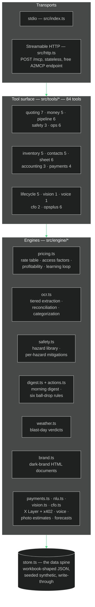

# Architecture

Evolved packages the operating brain of a working field-services company as a
Model Context Protocol server. This document explains the layers, the data
spine, the two feedback loops, and how the demo build maps onto the production
system it was born from.

## Layers

**Transports.** The same `createServer()` runs over stdio for local agent
clients and over Streamable HTTP for hosted use. The HTTP entry point is
deliberately **stateless** — a fresh server and transport per request — so the
free A2MCP endpoint scales horizontally and holds no session state.

**Tool surface.** 84 tools in 16 domains (the five originals plus inventory,
contacts/CRM, the ops-sheet engine, accounting depth, on-chain payments,
the autonomous lifecycle, the frontier set, business-in-a-box, the workbook
spine, field ops, and growth). Tools validate input with zod, call engines,
and return JSON. They never reach around the engines to touch the store
directly for business logic.

**The workbook spine.** The production company lives in a Google Sheets
operations workbook; `src/engine/sheets.ts` makes that portable. It renders
the entire database as 20 tabs, creates and syncs a real Google Sheets
workbook through a service-account JWT signed with `node:crypto` (no SDK
dependency, no stored tokens), and exports the identical tabs as CSV when no
credentials exist — the spine works offline by default and upgrades with one
env var (`EVOLVED_GOOGLE_SA`).

**Engines.** Pure logic, no MCP awareness. This is where the company's real
math and policy live: the rate table, the 5% GST and 25%-of-total deposit,
the exposed-aggregate-prices-as-medium rule, the escalation threshold, the
five auto-raise rules, and the weather gates.

**Data spine.** One JSON document shaped like the production operations
workbook — customers, leads, quotes, jobs, receipts, invoices, FLHAs, action
items, the rate table, and pricing outcomes. Every tool writes through
`withDb()`, which persists after each mutation.

## The two feedback loops

**Pricing learns.** `pricing_record_outcome` stores each job's quoted rate,
actual cost per sqft, margin, and won/lost. `effectiveRate()` blends the base
market rate with the average of winning outcomes at ≥20% margin for that
surface and depth, weighting history more as samples accumulate (capped at
80% learned) and never dropping below the market-floor base rate. The seed
dataset ships with a converged example: residential driveways at ~$9/sqft
from five winning jobs.

**The books self-audit.** `scanForActionItems()` runs on demand and inside
every morning digest. Six rules — deposit-in-but-unscheduled, invoice unpaid
7+ days, quote unanswered 7 days, quote expiring within 7 days, job complete
but not invoiced, and stale lead next-actions — raise deduplicated action
items so stalls surface instead of rotting.

## Production lineage

Evolved's shape comes from a live system that runs the real company:

| Evolved (this repo) | Production system |
|---|---|
| JSON data spine (`store.ts`) | Google Sheets operations workbook (~28 tabs), append-only discipline |
| Tool surface | Secret-authed JSON router API (`readTab`, `writeRow`, `setCell`, `markInbox`, `sendEmail`, ...) driven by a scheduled Claude agent |
| `receipt_ingest` pipeline | Field app photo capture → Drive OCR → heuristic parse → verification, duplicate guard, vendor roll-up, three-way filing (Expenses, Receipt Log, Price Log) |
| `morning_digest` | 6:30 AM autopilot email: one-thing-not-to-drop, spend pulse, weather verdicts, jobs board, system health |
| `flha_open` / `flha_signoff` | Net-new in Evolved — closes a real gap in the production system |
| Pricing engine | Quote Engine tab: same rates (2.50 / 3.75 / 6.90 / 14.50 CAD per sqft), same GST, deposit, mobilization, and break-even policy |

Two production bugs are fixed and regression-tested here rather than
inherited: the comma thousands-separator bug that undercounted large receipts
roughly 1000×, and unreconciled receipts posting without escalation or a
review flag.

Swapping the JSON spine for the live workbook is a storage-adapter change —
the engines and tool surface are already written against the workbook's
shape.

## Security posture

- No credentials required for any demo path; optional `ANTHROPIC_API_KEY`
  (live OCR) and `EVOLVED_LIVE_WEATHER` (live forecasts) are read from the
  environment only.
- The repository contains synthetic data exclusively — invented names,
  numbers, addresses, and dollar figures.
- `.gitignore` blocks env files, keys, tokens, and service-account patterns.
- Each deployment owns one data spine. The public demo deployment is a
  single shared synthetic dataset — disclosed on the playground — protected
  by a demo-scope tool whitelist, per-IP rate limits, and an hourly reseed;
  per-customer isolation is a deployment choice (separate `EVOLVED_DATA_DIR`
  per tenant), not a rewrite.
