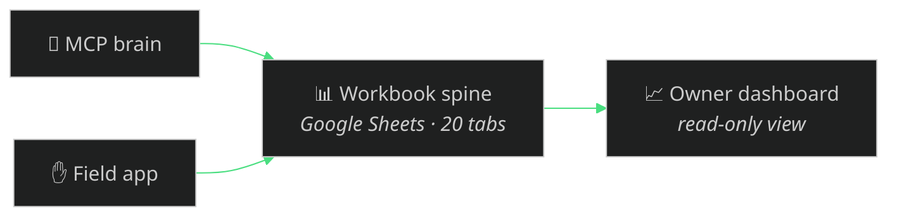

# The owner dashboard — the system's eyes

The fourth surface. Where the field app is the crew's hands and the MCP is the
brain, the **dashboard** is the owner's eyes: one always-current, login-protected
web view of the whole business, reading the **same workbook spine** every other
surface writes to.

> **Status: in active development.** This documents the integration contract so
> the dashboard drops onto the existing spine with no new coupling. The live URL
> and repo link are added here once it ships.

## What it shows

One screen, always current, from the same 20-tab workbook:

- Job P&Ls — quoted vs actual, margin, verdict
- Quotes and the pipeline (Leads → Quoted → Won/Lost)
- Receipts and expenses, outstanding invoices and unpaid deposits
- Hours owing (crew time clock → wages)
- To-dos and the action-item ball-drop catcher
- A materials **price tracker** (from the price log) and a **local-deals** feed

Same brand system as the rest of Evolved: Boreal Void `#0a0a0a`, Aurora Neon
`#4ade80`. Desktop-first, mobile-responsive.

## How it plugs in — read-only, onto the spine

The contract is deliberately narrow: **the dashboard reads the spine, it does
not write it.** The brain (MCP) and the crew (field app) are the only writers;
the dashboard shows. That keeps it safe (it can never corrupt the books) and
decoupled (it works against a live Google Sheet via the service account, or
against the zero-credential CSV export — the same two modes as `workbook_status`).

Two supported read paths, matching the rest of the system:

| Mode | Source | Setup |
|---|---|---|
| Live | The Google Sheet built by `workbook_create` | Share it read-only with the dashboard (link-shared read-only is already the default) |
| Offline | The CSV bundle from `workbook_export` / `scripts/make-workbook-template.mjs` | Point the dashboard at the exported folder |

## For adopters

Because the dashboard reads the **spine**, not blasting-specific tables, it works
for any business `franchise_spinup` creates — the tabs are the same 20 whatever
the trade. Your dashboard shows your trade's quotes, your P&Ls, your pricing
unit, your tax label. Nothing here is Evolve-specific; the structure is the gift.

**Boundary:** synthetic and template-only. No real customer data, financials,
workbook IDs, or secrets ship in this repo — an adopter points the dashboard at
their own spine.
