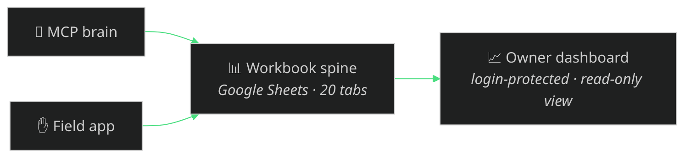

# The owner dashboard — the system's eyes

The fourth surface. The field app is the crew's **hands**, the MCP is the
**brain**, the workbook is the **spine** — and the dashboard is the owner's
**eyes**: one login-protected, mobile-responsive web app that reads the same ops
workbook and turns it into an always-current picture of the whole business.

Same brand system as the rest of Evolved — Boreal Void `#0a0a0a`, Aurora Neon
`#4ade80`. Deployed on Hostinger behind real authentication. A real Alberta
company runs on it today; because it reads the **spine** and not blasting-specific
tables, it works for any business `franchise_spinup` creates.

## What it gives the owner

- **Finance dashboard with interactive charts** — spend proportion, revenue and
  margin trends, job-profitability comparison.
- **Job P&Ls, quotes, invoices, and receivables** — every entity clickable
  through to the underlying document.
- **Receipts** — filterable records with pop-up receipt images.
- **Insights** — revenue last month, where the money actually went, margin
  trends, outstanding receivables.
- **Safety** — FLHAs, per-hazard mitigations, worker sign-offs, documented
  controls; audit-ready.
- **Maintenance** — equipment servicing, wear items, upcoming and overdue work.
- **Company inventory** — media, coatings, PPE, and consumables on hand, tied to
  a materials price tracker.

## How it plugs in — read-only, onto the spine

The contract is deliberately narrow: **the dashboard reads the spine, it does
not write it.** The brain (MCP) and the crew (field app) are the only writers;
the dashboard shows. That keeps it safe — it can never corrupt the books — and
decoupled: it works against a live Google Sheet (via the service account) or the
zero-credential CSV export, the same two modes as `workbook_status`.

| Mode | Source | Setup |
|---|---|---|
| Live | The Google Sheet built by `workbook_create` | Share it read-only with the dashboard (link-shared read-only is already the default) |
| Offline | The CSV bundle from `workbook_export` / `scripts/make-workbook-template.mjs` | Point the dashboard at the exported folder |

## Status & source

Deployed and in active development. It is part of the same free, open-source
system (MIT); the dashboard's own source is published in its repository as it is
scrubbed for public release — the link lands here and in the README when it's up.

## Boundary

Everything in **this** repo is synthetic and template-only. The public system
reads a synthetic workbook; the real Evolve deployment reads the company's live
workbook behind authentication. No real customer data, financials, workbook IDs,
router endpoints, or secrets ship here — an adopter points their own dashboard at
their own spine.
