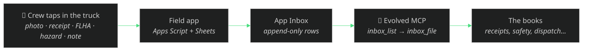

# The field app — the crew's front door to the MCP

Evolved's MCP server is the brain; the **field app** is the phone-friendly
front end the crew actually taps in the truck. It's a separate open-source repo
so you can deploy it on its own, and it plugs into the MCP through one narrow,
well-defined seam: the **App Inbox**.

- Repo: **[kr8tiv-ai/evolve-field-app](https://github.com/kr8tiv-ai/evolve-field-app)** (MIT)
- Runtime: Google Apps Script + Google Sheets — **$0/month**, no server to run
- What a worker does: tap once to log a photo, a receipt, an FLHA sign-off, a
  hazard report, or a quick note — from the jobsite, offline-tolerant

## How it plugs in

The contract is three MCP tools — nothing else couples the two systems:

| Tool | Role |
|---|---|
| `inbox_submit` | The field app appends one capture as a single inbox row (never touches the books directly) |
| `inbox_list` | The agent reads what's waiting in the inbox |
| `inbox_file` | The agent's deterministic filing engine routes each row to the right place — a receipt to the books, a note to a job, a lead to the pipeline |

Because the seam is just "append a row, then let the agent file it," the field
app stays dumb and safe: it can never corrupt the books, and the agent decides
(with human gates at money) what each capture becomes.

## Stand up your own

1. **Deploy the field app.** Follow the field-app repo's README — copy the
   Apps Script project, bind it to a Google Sheet, deploy as a web app, set a
   crew PIN. No secrets live in this repo; yours live in your Apps Script.
2. **Point it at your inbox.** The app writes captures that the MCP reads via
   `inbox_list`. In the demo they share the synthetic dataset; in production
   they share your workbook spine (see [ONBOARDING.md](ONBOARDING.md)).
3. **Let the agent file.** Run `inbox_file` (or the `morning-briefing` prompt)
   and captures flow into receipts, safety records, dispatch, and the pipeline.

Everything here is synthetic and template-only — no real crew data, no real
workbook, no secrets. Bring your own.
