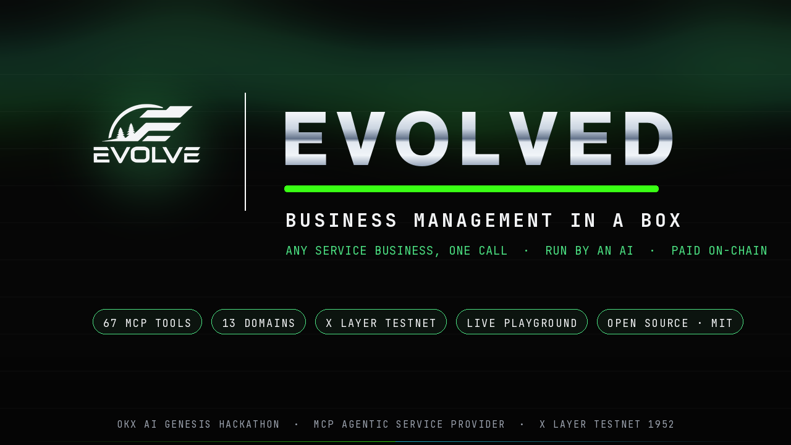
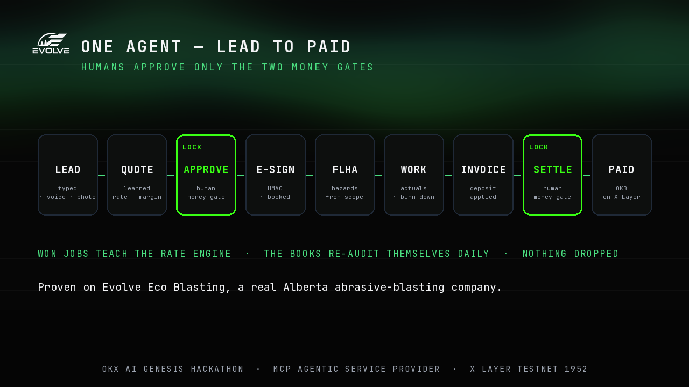
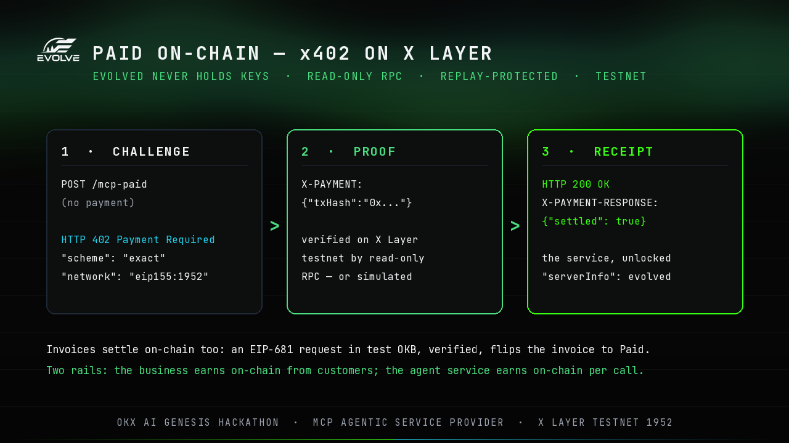
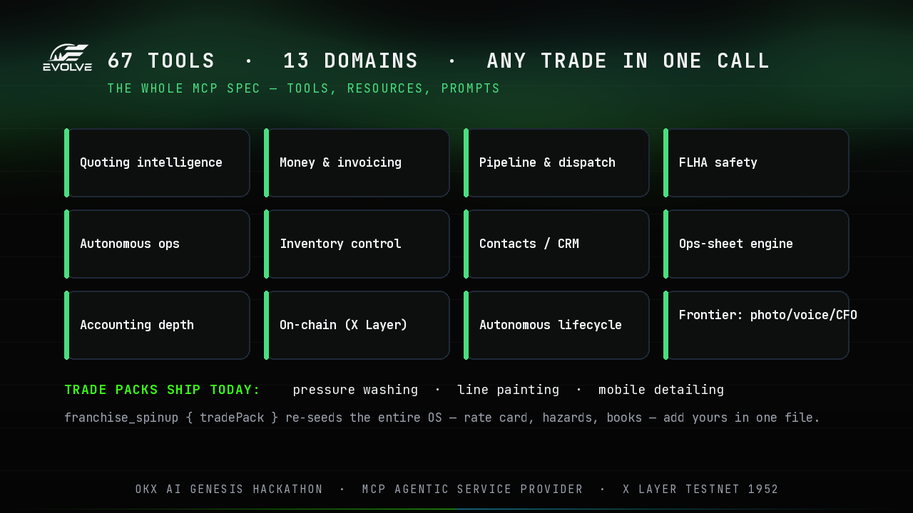

# Submission gallery

On-brand 1280×720 cards for the OKX AI Genesis Hackathon submission — dark
aurora, the real Evolve chrome logo, JetBrains Mono / Neue Montreal. Also
uploaded to the HackQuest project.

### Cover

### One agent — lead to paid (two human money gates)

### Paid on-chain — x402 on X Layer (402 → proof → receipt)

### 83 tools · 16 domains · any trade in one call

---

The product in action is live and clickable — run **Judge Mode** at
[the playground](https://www.evolvedmcp.cloud) to see
the lifecycle, the x402 settlement, the CFO chart, and the rate-learning bars
in motion. Regenerate these cards with `python scripts/make-gallery.py`.
