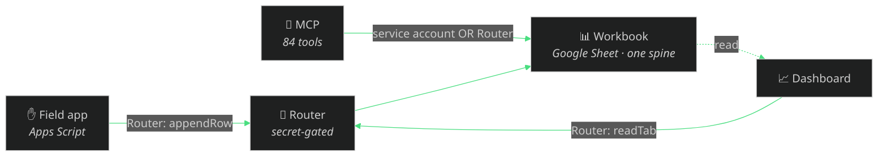

# How the four surfaces integrate — one system, one spine

Evolved is not four repos that link to each other. It is **one system with one
source of truth** — a Google Sheets **workbook** — that four surfaces share:



## The data model — everyone reads and writes the same tabs

The spine is a fixed set of tabs (the [evolve-ops-workbook](https://github.com/kr8tiv-ai/evolve-ops-workbook)
template ships them, and the MCP's `workbook_create` / `make-workbook-template.mjs`
generate them). Each surface owns some columns and reads others:

| Tab | Field app writes | MCP writes | Dashboard reads |
|---|---|---|---|
| Quotes | — | ✅ | ✅ |
| Job P&L | — | ✅ | ✅ |
| Leads / Dispatch | via inbox | ✅ | ✅ |
| Expenses / Receipts | ✅ (captures) | ✅ (OCR → books) | ✅ |
| Inventory / Suppliers | ✅ (counts) | ✅ | ✅ |
| Safety (FLHA) / Hazard reports | ✅ (sign-offs, hazards) | ✅ (drafts) | ✅ (audit view) |
| Time Log (crew hours) | ✅ (clock in/out) | ✅ (→ Job P&L labour) | ✅ (hours owing) |
| To-Do / Action Items | via inbox | ✅ (ball-drop scan) | ✅ |

Nobody talks to anybody directly — they meet at the sheet. That is what makes
them independently deployable and impossible to desync: there is only one copy
of the truth.

## The auth model — two paths, no shared secrets, no keys

- **MCP ↔ workbook:** a Google **service account** (`EVOLVED_GOOGLE_SA`). The MCP
  can hold a real credential, so it reads/writes the Sheet directly. With no
  credential it falls back to a local CSV spine (zero-credential demo).
- **Field app + dashboard ↔ workbook:** the **Router** — a secret-gated Apps
  Script web app ([router.gs](https://github.com/kr8tiv-ai/evolve-ops-workbook)).
  These surfaces never hold a Google credential; the Router's `ROUTER_SECRET` is
  the only gate, and each deployment generates its own.
- **On-chain:** the MCP **never holds a wallet key** — it issues EIP-681 requests
  and verifies settlement with read-only RPC. Funds move only from the payer's
  own wallet.

Each surface authenticates independently; none can escalate through another.

## What's verified vs. what's still aspirational

Honest status — no hand-waving:

| Claim | Status |
|---|---|
| MCP is live (84 tools), free `/mcp` + x402 `/mcp-paid` | **Verified** — `GET /health`, `tools/list` |
| Owner dashboard is live and login-gated (13 pages) | **Verified** — [ops.evolveecoblasting.com](https://ops.evolveecoblasting.com) returns the auth wall; all data endpoints 401 unauthenticated |
| Field app is deployed and in daily use | **Verified in production** (the real crew uses it); not exercisable from this public repo |
| All four surfaces read/write ONE workbook | **Verified in production** (the real Evolve sheet); the Router contract (`readTab`/`writeRow`/`appendRow`/`setCell`) is the seam |
| A stranger can generate the workbook + stand up each surface | **Verified per-piece** (each runs); the **end-to-end fresh deploy** is documented in [STAND-UP-YOUR-OWN.md](STAND-UP-YOUR-OWN.md) but not yet CI-tested as one flow |
| The MCP-generated workbook feeds the dashboard out of the box | **Verified.** The MCP emits the 25 tabs the dashboard reads; the dashboard's `evolved` profile (`COMPANY_PROFILE=evolved`) maps them — all 17 populated entities parse cleanly from the real CSV export (`evolve-dashboard/scripts/verify-evolved.js`). The only step needing a live secret is pointing the deployed dashboard's Router at your sheet |

## The schema bridge — closed

The dashboard is company-agnostic: it maps tabs and columns through a **profile**
(`config/profiles/*.js`). The bridge was closed from both ends:

- **MCP side:** `workbook_export` now emits five more tabs so the workbook is a
  superset of what the dashboard reads — **Vendors**, **Price Log**, **Price
  Watch** (derived), **Hazard Reports**, and **Maintenance** (a new synthetic
  domain). 25 tabs total.
- **Dashboard side:** a new profile, [`config/profiles/evolved.js`](https://github.com/kr8tiv-ai/evolve-dashboard/blob/main/config/profiles/evolved.js),
  maps the dashboard's 18 entities onto the MCP's exact tab and column headers
  (e.g. its `FLHA` view reads `Safety (FLHA)`, its hours view reads `Time Log`).
  Additive and non-breaking — it doesn't touch the default profile or the live
  deployment.

**Verified without a secret:** [`scripts/verify-evolved.js`](https://github.com/kr8tiv-ai/evolve-dashboard/blob/main/scripts/verify-evolved.js)
parses the MCP's real CSV export through the dashboard's own `lib/schema` with
this profile — **all 17 populated entities read cleanly** (quotes, jobs, leads,
dispatch, receipts, hours, inventory, price log/watch, suppliers, to-dos, action
items, customers, vendors, FLHA, hazard reports, maintenance). So the whole path
is proven end to end in code:

```
MCP workbook_create/export  ->  25-tab Google Sheet  ->  Router  ->  dashboard (COMPANY_PROFILE=evolved)
```

The one step that genuinely needs a live secret — pointing the *deployed*
dashboard's Router at your sheet — is a single `.env` line, documented in
[STAND-UP-YOUR-OWN.md](STAND-UP-YOUR-OWN.md). Everything before it is verified.

## Exercise the paths yourself

- **MCP → workbook:** `npm run build && node scripts/make-workbook-template.mjs blasting "Sample Co"` writes the 20 tabs; with `EVOLVED_GOOGLE_SA` set, `workbook_create` builds the live Sheet.
- **Dashboard:** `git clone` [evolve-dashboard](https://github.com/kr8tiv-ai/evolve-dashboard) `&& npm install && npm start` → `demo@example.com / demo1234` (credential-free).
- **Router:** deploy [router.gs](https://github.com/kr8tiv-ai/evolve-ops-workbook) with your own secret; `POST {secret, action:"ping"}` returns `{ok:true}`.
- **Field app:** deploy [evolve-field-app](https://github.com/kr8tiv-ai/evolve-field-app), point it at your Router.

Full walkthrough: [STAND-UP-YOUR-OWN.md](STAND-UP-YOUR-OWN.md).
