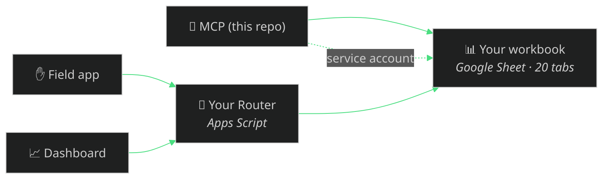

# Stand up your own — the whole system, for your company

Evolved is a complete, free, open-source operating system for **any** service
business — not just an MCP server. This is the one guide to running the whole
thing yourself: your own workbook, your own router, your own field app, your own
dashboard, your own MCP. Nothing here touches Evolve's data — you generate your
own everything.

**How long?** The MCP + workbook is an **afternoon**. Adding the field app and
the owner dashboard on top is a **weekend**. You can stop after any step — each
surface is optional and independent.



The **workbook is the spine** everything reads and writes. The **MCP** talks to
it directly with a Google service account (or offline CSV). The **field app**
and **dashboard** talk to it through a small **Router** (an Apps Script web app)
so they never hold a Google credential — the router's secret is the only gate.

---

## 1 · Your ops workbook (required · 10 min)

The backend template. Generate a starter 20-tab workbook seeded for your trade:

```bash
git clone https://github.com/kr8tiv-ai/evolved.git && cd evolved
npm install && npm run build
node scripts/make-workbook-template.mjs pressure-washing "My Company"
# → .data/workbook/*.csv  (20 tabs + INDEX.md), no Evolve content
```

Create a new Google Sheet and **File → Import** each CSV as its own tab (or keep
it CSV-only if you never need the human surfaces). That's your spine.

*Optional (nicer):* set `EVOLVED_GOOGLE_SA` to a Google service-account JSON and
run `workbook_create` — the MCP builds and syncs the live Sheet for you,
link-shared **read-only** by default.

## 2 · Your MCP (required · 20 min)

This repo **is** the brain. Point any MCP client at it (full copy-paste config:
[CONNECT.md](CONNECT.md)) and make it your company in one call:

```
franchise_spinup {
  companyName: "My Company", trade: "pressure washing",
  unit: "sqft", currency: "USD", gstRate: 0.0, taxLabel: "Sales Tax",
  tradePack: "pressure-washing", confirm: true
}
```

Your rate card, hazards, pricing unit, currency, and tax label — no fork, no
blasting boilerplate. If you set `EVOLVED_GOOGLE_SA`, the MCP reads and writes
your live workbook; with no credentials it runs on the local CSV spine. **You now
have a working business you can drive from any agent.** Everything below is
optional human-facing polish.

## 3 · Your Apps Script Router (optional · needed only for the field app + dashboard · 30 min)

The field app and dashboard reach your workbook through a tiny secret-gated web
app. Use the clean-room template — [`templates/router.gs`](../templates/router.gs):

1. Your workbook → **Extensions → Apps Script**, paste `templates/router.gs`.
2. **Generate your OWN secret** (`openssl rand -hex 24`) and set it in
   Project Settings → Script properties as `ROUTER_SECRET`.
3. Run `setup()` once — it verifies your secret is set.
4. **Deploy → Web app**, execute as *Me*, access *Anyone* (the secret is the
   gate). Copy the `/exec` URL.

> Two footguns the template already fixes (both real, both bite newcomers): it
> **never logs your secret** to the execution log, and `setup()` **refuses to
> auto-mint** a missing secret (a router that invents one silently breaks every
> consumer at once, with no copy of the value). You set it; the template verifies.

## 4 · Your field app (optional · 20 min)

The crew's hands — [kr8tiv-ai/evolve-field-app](https://github.com/kr8tiv-ai/evolve-field-app)
(MIT, $0/month on Apps Script). Deploy it per its README and point it at **your**
router URL + secret. Crews tap once in the truck; captures land in the App Inbox
for the MCP to file. Integration detail: [FIELD-APP.md](FIELD-APP.md).

## 5 · Your dashboard (optional · 30 min)

The owner's eyes — a login-protected web app that reads your workbook through the
same router. Live reference instance: **[ops.evolveecoblasting.com](https://ops.evolveecoblasting.com)**
(behind auth). Source is being published to `kr8tiv-ai/evolve-dashboard` (MIT);
its README carries the exact env vars, router actions, and workbook tabs it
expects — deploy it, point it at **your** router, set your own login. Overview:
[DASHBOARD.md](DASHBOARD.md).

---

## What's required vs optional

| Piece | Required? | Effort | Talks to |
|---|---|---|---|
| Ops workbook | ✅ the spine | 10 min | — |
| MCP (this repo) | ✅ the brain | 20 min | workbook (service account or CSV) |
| Router | only for field app / dashboard | 30 min | workbook |
| Field app | optional | 20 min | your router |
| Dashboard | optional | 30 min | your router |
| On-chain (x402 / EIP-681) | optional, opt-in | — | X Layer testnet |

**Afternoon** = steps 1–2 (a working agent-run business). **Weekend** = add
3–5 for the crew and owner surfaces. Everything is MIT and free; nothing is
paywalled; the x402 rail is opt-in and off by default.

## Boundary

Every file in these repos is synthetic and template-only. No real customer data,
financials, workbook IDs, router URLs, or secrets — you bring your own. The
structure is the gift.
